<!-- markdownlint-capture -->
<!-- markdownlint-disable -->

# Code Metrics

This file is dynamically maintained by a bot, *please do not* edit this by hand. It represents various [code metrics](https://aka.ms/dotnet/code-metrics), such as cyclomatic complexity, maintainability index, and so on.

<div id='myjetwallet-sdk-service-test'></div>

## MyJetWallet.Sdk.Service.Test :heavy_check_mark:

The *MyJetWallet.Sdk.Service.Test.csproj* project file contains:

- 1 namespaces.
- 5 named types.
- 109 total lines of source code.
- Approximately 23 lines of executable code.
- The highest cyclomatic complexity is 5 :heavy_check_mark:.

<details>
<summary>
  <strong id="myjetwallet-sdk-service-test">
    MyJetWallet.Sdk.Service.Test :heavy_check_mark:
  </strong>
</summary>
<br>

The `MyJetWallet.Sdk.Service.Test` namespace contains 5 named types.

- 5 named types.
- 109 total lines of source code.
- Approximately 23 lines of executable code.
- The highest cyclomatic complexity is 5 :heavy_check_mark:.

<details>
<summary>
  <strong id="mynamejsonmaskconvertertest">
    MyNameJsonMaskConverterTest :question:
  </strong>
</summary>
<br>

- The `MyNameJsonMaskConverterTest` contains 0 members.
- 107 total lines of source code.
- Approximately 0 lines of executable code.
- The highest cyclomatic complexity is 0 :question:.

| Member kind | Line number | Maintainability index | Cyclomatic complexity | Depth of inheritance | Class coupling | Lines of source / executable code |
| :-: | :-: | :-: | :-: | :-: | :-: | :-: |

<a href="#MyNameJsonMaskConverterTest-class-diagram">:link: to `MyNameJsonMaskConverterTest` class diagram</a>

<a href="#myjetwallet-sdk-service-test">:top: back to MyJetWallet.Sdk.Service.Test</a>

</details>

<details>
<summary>
  <strong id="mynamejsonmaskconvertertest-myusers">
    MyNameJsonMaskConverterTest.MyUsers :heavy_check_mark:
  </strong>
</summary>
<br>

- The `MyNameJsonMaskConverterTest.MyUsers` contains 2 members.
- 5 total lines of source code.
- Approximately 1 lines of executable code.
- The highest cyclomatic complexity is 2 :heavy_check_mark:.

| Member kind | Line number | Maintainability index | Cyclomatic complexity | Depth of inheritance | Class coupling | Lines of source / executable code |
| :-: | :-: | :-: | :-: | :-: | :-: | :-: |
| Property | <a href='https://github.com/MyJetWallet/MyJetWallet.Sdk.Service/blob/master/src/MyJetWallet.Sdk.Service.Test/MyNameJsonMaskConverterTest.cs#L11' title='User MyUsers.Author'>11</a> | 100 | 2 :heavy_check_mark: | 0 | 1 | 1 / 0 |
| Property | <a href='https://github.com/MyJetWallet/MyJetWallet.Sdk.Service/blob/master/src/MyJetWallet.Sdk.Service.Test/MyNameJsonMaskConverterTest.cs#L10' title='List<User> MyUsers.Users'>10</a> | 100 | 2 :heavy_check_mark: | 0 | 2 | 1 / 1 |

<a href="#MyNameJsonMaskConverterTest.MyUsers-class-diagram">:link: to `MyNameJsonMaskConverterTest.MyUsers` class diagram</a>

<a href="#myjetwallet-sdk-service-test">:top: back to MyJetWallet.Sdk.Service.Test</a>

</details>

<details>
<summary>
  <strong id="mynamejsonmaskconvertertest-testlogmaskedattributes">
    MyNameJsonMaskConverterTest.TestLogMaskedAttributes :heavy_check_mark:
  </strong>
</summary>
<br>

- The `MyNameJsonMaskConverterTest.TestLogMaskedAttributes` contains 2 members.
- 74 total lines of source code.
- Approximately 14 lines of executable code.
- The highest cyclomatic complexity is 5 :heavy_check_mark:.

| Member kind | Line number | Maintainability index | Cyclomatic complexity | Depth of inheritance | Class coupling | Lines of source / executable code |
| :-: | :-: | :-: | :-: | :-: | :-: | :-: |
| Method | <a href='https://github.com/MyJetWallet/MyJetWallet.Sdk.Service/blob/master/src/MyJetWallet.Sdk.Service.Test/MyNameJsonMaskConverterTest.cs#L64' title='void TestLogMaskedAttributes.ArrayOfUsersLogMaskedAttribute()'>64</a> | 62 | 5 :heavy_check_mark: | 0 | 6 | 48 / 7 |
| Method | <a href='https://github.com/MyJetWallet/MyJetWallet.Sdk.Service/blob/master/src/MyJetWallet.Sdk.Service.Test/MyNameJsonMaskConverterTest.cs#L41' title='void TestLogMaskedAttributes.OneUseLogMaskedAttribute()'>41</a> | 64 | 5 :heavy_check_mark: | 0 | 4 | 22 / 7 |

<a href="#MyNameJsonMaskConverterTest.TestLogMaskedAttributes-class-diagram">:link: to `MyNameJsonMaskConverterTest.TestLogMaskedAttributes` class diagram</a>

<a href="#myjetwallet-sdk-service-test">:top: back to MyJetWallet.Sdk.Service.Test</a>

</details>

<details>
<summary>
  <strong id="mynamejsonmaskconvertertest-user">
    MyNameJsonMaskConverterTest.User :heavy_check_mark:
  </strong>
</summary>
<br>

- The `MyNameJsonMaskConverterTest.User` contains 5 members.
- 15 total lines of source code.
- Approximately 6 lines of executable code.
- The highest cyclomatic complexity is 2 :heavy_check_mark:.

| Member kind | Line number | Maintainability index | Cyclomatic complexity | Depth of inheritance | Class coupling | Lines of source / executable code |
| :-: | :-: | :-: | :-: | :-: | :-: | :-: |
| Property | <a href='https://github.com/MyJetWallet/MyJetWallet.Sdk.Service/blob/master/src/MyJetWallet.Sdk.Service.Test/MyNameJsonMaskConverterTest.cs#L27' title='string User.Card'>27</a> | 100 | 2 :heavy_check_mark: | 0 | 2 | 2 / 2 |
| Property | <a href='https://github.com/MyJetWallet/MyJetWallet.Sdk.Service/blob/master/src/MyJetWallet.Sdk.Service.Test/MyNameJsonMaskConverterTest.cs#L22' title='string User.Email'>22</a> | 100 | 2 :heavy_check_mark: | 0 | 2 | 2 / 2 |
| Property | <a href='https://github.com/MyJetWallet/MyJetWallet.Sdk.Service/blob/master/src/MyJetWallet.Sdk.Service.Test/MyNameJsonMaskConverterTest.cs#L16' title='string User.Id'>16</a> | 100 | 2 :heavy_check_mark: | 0 | 0 | 1 / 0 |
| Property | <a href='https://github.com/MyJetWallet/MyJetWallet.Sdk.Service/blob/master/src/MyJetWallet.Sdk.Service.Test/MyNameJsonMaskConverterTest.cs#L24' title='UserToken User.Token'>24</a> | 100 | 2 :heavy_check_mark: | 0 | 1 | 1 / 0 |
| Property | <a href='https://github.com/MyJetWallet/MyJetWallet.Sdk.Service/blob/master/src/MyJetWallet.Sdk.Service.Test/MyNameJsonMaskConverterTest.cs#L19' title='string User.UserName'>19</a> | 100 | 2 :heavy_check_mark: | 0 | 2 | 2 / 2 |

<a href="#MyNameJsonMaskConverterTest.User-class-diagram">:link: to `MyNameJsonMaskConverterTest.User` class diagram</a>

<a href="#myjetwallet-sdk-service-test">:top: back to MyJetWallet.Sdk.Service.Test</a>

</details>

<details>
<summary>
  <strong id="mynamejsonmaskconvertertest-usertoken">
    MyNameJsonMaskConverterTest.UserToken :heavy_check_mark:
  </strong>
</summary>
<br>

- The `MyNameJsonMaskConverterTest.UserToken` contains 2 members.
- 7 total lines of source code.
- Approximately 2 lines of executable code.
- The highest cyclomatic complexity is 2 :heavy_check_mark:.

| Member kind | Line number | Maintainability index | Cyclomatic complexity | Depth of inheritance | Class coupling | Lines of source / executable code |
| :-: | :-: | :-: | :-: | :-: | :-: | :-: |
| Property | <a href='https://github.com/MyJetWallet/MyJetWallet.Sdk.Service/blob/master/src/MyJetWallet.Sdk.Service.Test/MyNameJsonMaskConverterTest.cs#L35' title='string UserToken.PrivateToken'>35</a> | 100 | 2 :heavy_check_mark: | 0 | 2 | 2 / 2 |
| Property | <a href='https://github.com/MyJetWallet/MyJetWallet.Sdk.Service/blob/master/src/MyJetWallet.Sdk.Service.Test/MyNameJsonMaskConverterTest.cs#L32' title='string UserToken.PublicToken'>32</a> | 100 | 2 :heavy_check_mark: | 0 | 0 | 1 / 0 |

<a href="#MyNameJsonMaskConverterTest.UserToken-class-diagram">:link: to `MyNameJsonMaskConverterTest.UserToken` class diagram</a>

<a href="#myjetwallet-sdk-service-test">:top: back to MyJetWallet.Sdk.Service.Test</a>

</details>

</details>

<a href="#myjetwallet-sdk-service-test">:top: back to MyJetWallet.Sdk.Service.Test</a>

<div id='myjetwallet-sdk-service'></div>

## MyJetWallet.Sdk.Service :exploding_head:

The *MyJetWallet.Sdk.Service.csproj* project file contains:

- 5 namespaces.
- 34 named types.
- 1,460 total lines of source code.
- Approximately 424 lines of executable code.
- The highest cyclomatic complexity is 22 :exploding_head:.

<details>
<summary>
  <strong id="myjetwallet-sdk-service-tools-jsonmaskconverter">
    MyJetWallet.Sdk.Service.Tools.JsonMaskConverter :exploding_head:
  </strong>
</summary>
<br>

The `MyJetWallet.Sdk.Service.Tools.JsonMaskConverter` namespace contains 5 named types.

- 5 named types.
- 152 total lines of source code.
- Approximately 36 lines of executable code.
- The highest cyclomatic complexity is 22 :exploding_head:.

<details>
<summary>
  <strong id="mycardjsonmaskconverter">
    MyCardJsonMaskConverter :heavy_check_mark:
  </strong>
</summary>
<br>

- The `MyCardJsonMaskConverter` contains 1 members.
- 7 total lines of source code.
- Approximately 0 lines of executable code.
- The highest cyclomatic complexity is 1 :heavy_check_mark:.

| Member kind | Line number | Maintainability index | Cyclomatic complexity | Depth of inheritance | Class coupling | Lines of source / executable code |
| :-: | :-: | :-: | :-: | :-: | :-: | :-: |
| Method | <a href='https://github.com/MyJetWallet/MyJetWallet.Sdk.Service/blob/master/src/MyJetWallet.Sdk.Service/Tools/JsonMaskConverter/MyCardJsonMaskConverter.cs#L5' title='MyCardJsonMaskConverter.MyCardJsonMaskConverter()'>5</a> | 94 | 1 :heavy_check_mark: | 0 | 1 | 4 / 0 |

<a href="#MyCardJsonMaskConverter-class-diagram">:link: to `MyCardJsonMaskConverter` class diagram</a>

<a href="#myjetwallet-sdk-service-tools-jsonmaskconverter">:top: back to MyJetWallet.Sdk.Service.Tools.JsonMaskConverter</a>

</details>

<details>
<summary>
  <strong id="mydefaultjsonmaskconverter">
    MyDefaultJsonMaskConverter :exploding_head:
  </strong>
</summary>
<br>

- The `MyDefaultJsonMaskConverter` contains 12 members.
- 118 total lines of source code.
- Approximately 36 lines of executable code.
- The highest cyclomatic complexity is 22 :exploding_head:.

| Member kind | Line number | Maintainability index | Cyclomatic complexity | Depth of inheritance | Class coupling | Lines of source / executable code |
| :-: | :-: | :-: | :-: | :-: | :-: | :-: |
| Method | <a href='https://github.com/MyJetWallet/MyJetWallet.Sdk.Service/blob/master/src/MyJetWallet.Sdk.Service/Tools/JsonMaskConverter/MyDefaultJsonMaskConverter.cs#L36' title='MyDefaultJsonMaskConverter.MyDefaultJsonMaskConverter()'>36</a> | 79 | 1 :heavy_check_mark: | 0 | 0 | 6 / 3 |
| Method | <a href='https://github.com/MyJetWallet/MyJetWallet.Sdk.Service/blob/master/src/MyJetWallet.Sdk.Service/Tools/JsonMaskConverter/MyDefaultJsonMaskConverter.cs#L43' title='MyDefaultJsonMaskConverter.MyDefaultJsonMaskConverter(int showFirst, int showLast, bool preserveLength)'>43</a> | 79 | 1 :heavy_check_mark: | 0 | 0 | 6 / 3 |
| Method | <a href='https://github.com/MyJetWallet/MyJetWallet.Sdk.Service/blob/master/src/MyJetWallet.Sdk.Service/Tools/JsonMaskConverter/MyDefaultJsonMaskConverter.cs#L60' title='bool MyDefaultJsonMaskConverter.CanConvert(Type objectType)'>60</a> | 96 | 1 :heavy_check_mark: | 0 | 2 | 4 / 1 |
| Field | <a href='https://github.com/MyJetWallet/MyJetWallet.Sdk.Service/blob/master/src/MyJetWallet.Sdk.Service/Tools/JsonMaskConverter/MyDefaultJsonMaskConverter.cs#L8' title='string MyDefaultJsonMaskConverter.DefaultMask'>8</a> | 93 | 0 :heavy_check_mark: | 0 | 0 | 1 / 1 |
| Method | <a href='https://github.com/MyJetWallet/MyJetWallet.Sdk.Service/blob/master/src/MyJetWallet.Sdk.Service/Tools/JsonMaskConverter/MyDefaultJsonMaskConverter.cs#L65' title='object MyDefaultJsonMaskConverter.FormatMaskedValue(string value)'>65</a> | 46 | 22 :exploding_head: | 0 | 2 | 58 / 24 |
| Method | <a href='https://github.com/MyJetWallet/MyJetWallet.Sdk.Service/blob/master/src/MyJetWallet.Sdk.Service/Tools/JsonMaskConverter/MyDefaultJsonMaskConverter.cs#L31' title='bool MyDefaultJsonMaskConverter.IsDefaultMask()'>31</a> | 93 | 1 :heavy_check_mark: | 0 | 0 | 4 / 1 |
| Property | <a href='https://github.com/MyJetWallet/MyJetWallet.Sdk.Service/blob/master/src/MyJetWallet.Sdk.Service/Tools/JsonMaskConverter/MyDefaultJsonMaskConverter.cs#L29' title='bool MyDefaultJsonMaskConverter.PreserveLength'>29</a> | 100 | 2 :heavy_check_mark: | 0 | 0 | 5 / 0 |
| Method | <a href='https://github.com/MyJetWallet/MyJetWallet.Sdk.Service/blob/master/src/MyJetWallet.Sdk.Service/Tools/JsonMaskConverter/MyDefaultJsonMaskConverter.cs#L55' title='object MyDefaultJsonMaskConverter.ReadJson(JsonReader reader, Type objectType, object existingValue, JsonSerializer serializer)'>55</a> | 97 | 1 :heavy_check_mark: | 0 | 4 | 4 / 1 |
| Property | <a href='https://github.com/MyJetWallet/MyJetWallet.Sdk.Service/blob/master/src/MyJetWallet.Sdk.Service/Tools/JsonMaskConverter/MyDefaultJsonMaskConverter.cs#L18' title='int MyDefaultJsonMaskConverter.ShowFirst'>18</a> | 100 | 2 :heavy_check_mark: | 0 | 0 | 4 / 0 |
| Property | <a href='https://github.com/MyJetWallet/MyJetWallet.Sdk.Service/blob/master/src/MyJetWallet.Sdk.Service/Tools/JsonMaskConverter/MyDefaultJsonMaskConverter.cs#L23' title='int MyDefaultJsonMaskConverter.ShowLast'>23</a> | 100 | 2 :heavy_check_mark: | 0 | 0 | 4 / 0 |
| Property | <a href='https://github.com/MyJetWallet/MyJetWallet.Sdk.Service/blob/master/src/MyJetWallet.Sdk.Service/Tools/JsonMaskConverter/MyDefaultJsonMaskConverter.cs#L13' title='string MyDefaultJsonMaskConverter.Text'>13</a> | 100 | 2 :heavy_check_mark: | 0 | 0 | 4 / 1 |
| Method | <a href='https://github.com/MyJetWallet/MyJetWallet.Sdk.Service/blob/master/src/MyJetWallet.Sdk.Service/Tools/JsonMaskConverter/MyDefaultJsonMaskConverter.cs#L50' title='void MyDefaultJsonMaskConverter.WriteJson(JsonWriter writer, object value, JsonSerializer serializer)'>50</a> | 94 | 1 :heavy_check_mark: | 0 | 3 | 4 / 1 |

<a href="#MyDefaultJsonMaskConverter-class-diagram">:link: to `MyDefaultJsonMaskConverter` class diagram</a>

<a href="#myjetwallet-sdk-service-tools-jsonmaskconverter">:top: back to MyJetWallet.Sdk.Service.Tools.JsonMaskConverter</a>

</details>

<details>
<summary>
  <strong id="myemailjsonmaskconverter">
    MyEmailJsonMaskConverter :heavy_check_mark:
  </strong>
</summary>
<br>

- The `MyEmailJsonMaskConverter` contains 1 members.
- 7 total lines of source code.
- Approximately 0 lines of executable code.
- The highest cyclomatic complexity is 1 :heavy_check_mark:.

| Member kind | Line number | Maintainability index | Cyclomatic complexity | Depth of inheritance | Class coupling | Lines of source / executable code |
| :-: | :-: | :-: | :-: | :-: | :-: | :-: |
| Method | <a href='https://github.com/MyJetWallet/MyJetWallet.Sdk.Service/blob/master/src/MyJetWallet.Sdk.Service/Tools/JsonMaskConverter/MyEmailJsonMaskConverter.cs#L5' title='MyEmailJsonMaskConverter.MyEmailJsonMaskConverter()'>5</a> | 94 | 1 :heavy_check_mark: | 0 | 1 | 4 / 0 |

<a href="#MyEmailJsonMaskConverter-class-diagram">:link: to `MyEmailJsonMaskConverter` class diagram</a>

<a href="#myjetwallet-sdk-service-tools-jsonmaskconverter">:top: back to MyJetWallet.Sdk.Service.Tools.JsonMaskConverter</a>

</details>

<details>
<summary>
  <strong id="mynamejsonmaskconverter">
    MyNameJsonMaskConverter :heavy_check_mark:
  </strong>
</summary>
<br>

- The `MyNameJsonMaskConverter` contains 1 members.
- 7 total lines of source code.
- Approximately 0 lines of executable code.
- The highest cyclomatic complexity is 1 :heavy_check_mark:.

| Member kind | Line number | Maintainability index | Cyclomatic complexity | Depth of inheritance | Class coupling | Lines of source / executable code |
| :-: | :-: | :-: | :-: | :-: | :-: | :-: |
| Method | <a href='https://github.com/MyJetWallet/MyJetWallet.Sdk.Service/blob/master/src/MyJetWallet.Sdk.Service/Tools/JsonMaskConverter/MyNameJsonMaskConverter.cs#L5' title='MyNameJsonMaskConverter.MyNameJsonMaskConverter()'>5</a> | 96 | 1 :heavy_check_mark: | 0 | 1 | 4 / 0 |

<a href="#MyNameJsonMaskConverter-class-diagram">:link: to `MyNameJsonMaskConverter` class diagram</a>

<a href="#myjetwallet-sdk-service-tools-jsonmaskconverter">:top: back to MyJetWallet.Sdk.Service.Tools.JsonMaskConverter</a>

</details>

<details>
<summary>
  <strong id="myphonejsonmaskconverter">
    MyPhoneJsonMaskConverter :heavy_check_mark:
  </strong>
</summary>
<br>

- The `MyPhoneJsonMaskConverter` contains 1 members.
- 7 total lines of source code.
- Approximately 0 lines of executable code.
- The highest cyclomatic complexity is 1 :heavy_check_mark:.

| Member kind | Line number | Maintainability index | Cyclomatic complexity | Depth of inheritance | Class coupling | Lines of source / executable code |
| :-: | :-: | :-: | :-: | :-: | :-: | :-: |
| Method | <a href='https://github.com/MyJetWallet/MyJetWallet.Sdk.Service/blob/master/src/MyJetWallet.Sdk.Service/Tools/JsonMaskConverter/MyPhoneJsonMaskConverter.cs#L5' title='MyPhoneJsonMaskConverter.MyPhoneJsonMaskConverter()'>5</a> | 96 | 1 :heavy_check_mark: | 0 | 1 | 4 / 0 |

<a href="#MyPhoneJsonMaskConverter-class-diagram">:link: to `MyPhoneJsonMaskConverter` class diagram</a>

<a href="#myjetwallet-sdk-service-tools-jsonmaskconverter">:top: back to MyJetWallet.Sdk.Service.Tools.JsonMaskConverter</a>

</details>

</details>

<details>
<summary>
  <strong id="myjetwallet-sdk-service-livenessprobs">
    MyJetWallet.Sdk.Service.LivenessProbs :heavy_check_mark:
  </strong>
</summary>
<br>

The `MyJetWallet.Sdk.Service.LivenessProbs` namespace contains 1 named types.

- 1 named types.
- 39 total lines of source code.
- Approximately 11 lines of executable code.
- The highest cyclomatic complexity is 3 :heavy_check_mark:.

<details>
<summary>
  <strong id="livnessmiddleware">
    LivnessMiddleware :heavy_check_mark:
  </strong>
</summary>
<br>

- The `LivnessMiddleware` contains 5 members.
- 36 total lines of source code.
- Approximately 11 lines of executable code.
- The highest cyclomatic complexity is 3 :heavy_check_mark:.

| Member kind | Line number | Maintainability index | Cyclomatic complexity | Depth of inheritance | Class coupling | Lines of source / executable code |
| :-: | :-: | :-: | :-: | :-: | :-: | :-: |
| Field | <a href='https://github.com/MyJetWallet/MyJetWallet.Sdk.Service/blob/master/src/MyJetWallet.Sdk.Service/LivenessProbs/LivnessMiddleware.cs#L12' title='ILogger<LivnessMiddleware> LivnessMiddleware._logger'>12</a> | 100 | 0 :heavy_check_mark: | 0 | 1 | 1 / 0 |
| Field | <a href='https://github.com/MyJetWallet/MyJetWallet.Sdk.Service/blob/master/src/MyJetWallet.Sdk.Service/LivenessProbs/LivnessMiddleware.cs#L13' title='LivenessManager LivnessMiddleware._manager'>13</a> | 100 | 0 :heavy_check_mark: | 0 | 1 | 1 / 0 |
| Field | <a href='https://github.com/MyJetWallet/MyJetWallet.Sdk.Service/blob/master/src/MyJetWallet.Sdk.Service/LivenessProbs/LivnessMiddleware.cs#L11' title='RequestDelegate LivnessMiddleware._next'>11</a> | 100 | 0 :heavy_check_mark: | 0 | 1 | 1 / 0 |
| Method | <a href='https://github.com/MyJetWallet/MyJetWallet.Sdk.Service/blob/master/src/MyJetWallet.Sdk.Service/LivenessProbs/LivnessMiddleware.cs#L15' title='LivnessMiddleware.LivnessMiddleware(RequestDelegate next, ILogger<LivnessMiddleware> logger, LivenessManager manager)'>15</a> | 79 | 1 :heavy_check_mark: | 0 | 3 | 6 / 3 |
| Method | <a href='https://github.com/MyJetWallet/MyJetWallet.Sdk.Service/blob/master/src/MyJetWallet.Sdk.Service/LivenessProbs/LivnessMiddleware.cs#L22' title='Task LivnessMiddleware.InvokeAsync(HttpContext context)'>22</a> | 66 | 3 :heavy_check_mark: | 0 | 7 | 22 / 8 |

<a href="#LivnessMiddleware-class-diagram">:link: to `LivnessMiddleware` class diagram</a>

<a href="#myjetwallet-sdk-service-livenessprobs">:top: back to MyJetWallet.Sdk.Service.LivenessProbs</a>

</details>

</details>

<details>
<summary>
  <strong id="myjetwallet-sdk-service-livnesprobs">
    MyJetWallet.Sdk.Service.LivnesProbs :heavy_check_mark:
  </strong>
</summary>
<br>

The `MyJetWallet.Sdk.Service.LivnesProbs` namespace contains 2 named types.

- 2 named types.
- 66 total lines of source code.
- Approximately 18 lines of executable code.
- The highest cyclomatic complexity is 4 :heavy_check_mark:.

<details>
<summary>
  <strong id="ilivenessreporter">
    ILivenessReporter :heavy_check_mark:
  </strong>
</summary>
<br>

- The `ILivenessReporter` contains 1 members.
- 4 total lines of source code.
- Approximately 0 lines of executable code.
- The highest cyclomatic complexity is 1 :heavy_check_mark:.

| Member kind | Line number | Maintainability index | Cyclomatic complexity | Depth of inheritance | Class coupling | Lines of source / executable code |
| :-: | :-: | :-: | :-: | :-: | :-: | :-: |
| Method | <a href='https://github.com/MyJetWallet/MyJetWallet.Sdk.Service/blob/master/src/MyJetWallet.Sdk.Service/LivenessProbs/LivenessManager.cs#L72' title='(string, List<string>) ILivenessReporter.GetIssues()'>72</a> | 100 | 1 :heavy_check_mark: | 0 | 2 | 1 / 0 |

<a href="#ILivenessReporter-class-diagram">:link: to `ILivenessReporter` class diagram</a>

<a href="#myjetwallet-sdk-service-livnesprobs">:top: back to MyJetWallet.Sdk.Service.LivnesProbs</a>

</details>

<details>
<summary>
  <strong id="livenessmanager">
    LivenessManager :heavy_check_mark:
  </strong>
</summary>
<br>

- The `LivenessManager` contains 8 members.
- 58 total lines of source code.
- Approximately 18 lines of executable code.
- The highest cyclomatic complexity is 4 :heavy_check_mark:.

| Member kind | Line number | Maintainability index | Cyclomatic complexity | Depth of inheritance | Class coupling | Lines of source / executable code |
| :-: | :-: | :-: | :-: | :-: | :-: | :-: |
| Field | <a href='https://github.com/MyJetWallet/MyJetWallet.Sdk.Service/blob/master/src/MyJetWallet.Sdk.Service/LivenessProbs/LivenessManager.cs#L14' title='ILogger<LivenessManager> LivenessManager._logger'>14</a> | 100 | 0 :heavy_check_mark: | 0 | 1 | 1 / 0 |
| Field | <a href='https://github.com/MyJetWallet/MyJetWallet.Sdk.Service/blob/master/src/MyJetWallet.Sdk.Service/LivenessProbs/LivenessManager.cs#L13' title='ILivenessReporter[] LivenessManager._reporters'>13</a> | 100 | 0 :heavy_check_mark: | 0 | 0 | 1 / 0 |
| Field | <a href='https://github.com/MyJetWallet/MyJetWallet.Sdk.Service/blob/master/src/MyJetWallet.Sdk.Service/LivenessProbs/LivenessManager.cs#L15' title='MyTaskTimer LivenessManager._timer'>15</a> | 100 | 0 :heavy_check_mark: | 0 | 1 | 1 / 0 |
| Method | <a href='https://github.com/MyJetWallet/MyJetWallet.Sdk.Service/blob/master/src/MyJetWallet.Sdk.Service/LivenessProbs/LivenessManager.cs#L21' title='LivenessManager.LivenessManager(ILivenessReporter[] reporters, ILogger<LivenessManager> logger)'>21</a> | 69 | 2 :heavy_check_mark: | 0 | 6 | 17 / 6 |
| Method | <a href='https://github.com/MyJetWallet/MyJetWallet.Sdk.Service/blob/master/src/MyJetWallet.Sdk.Service/LivenessProbs/LivenessManager.cs#L39' title='Task LivenessManager.DoTime()'>39</a> | 65 | 4 :heavy_check_mark: | 0 | 8 | 23 / 9 |
| Property | <a href='https://github.com/MyJetWallet/MyJetWallet.Sdk.Service/blob/master/src/MyJetWallet.Sdk.Service/LivenessProbs/LivenessManager.cs#L18' title='LivenessManager LivenessManager.Instance'>18</a> | 100 | 2 :heavy_check_mark: | 0 | 0 | 1 / 0 |
| Property | <a href='https://github.com/MyJetWallet/MyJetWallet.Sdk.Service/blob/master/src/MyJetWallet.Sdk.Service/LivenessProbs/LivenessManager.cs#L16' title='Dictionary<string, List<string>> LivenessManager.Issues'>16</a> | 100 | 2 :heavy_check_mark: | 0 | 2 | 1 / 1 |
| Method | <a href='https://github.com/MyJetWallet/MyJetWallet.Sdk.Service/blob/master/src/MyJetWallet.Sdk.Service/LivenessProbs/LivenessManager.cs#L63' title='void LivenessManager.Start()'>63</a> | 89 | 1 :heavy_check_mark: | 0 | 2 | 5 / 2 |

<a href="#LivenessManager-class-diagram">:link: to `LivenessManager` class diagram</a>

<a href="#myjetwallet-sdk-service-livnesprobs">:top: back to MyJetWallet.Sdk.Service.LivnesProbs</a>

</details>

</details>

<details>
<summary>
  <strong id="myjetwallet-sdk-service">
    MyJetWallet.Sdk.Service :x:
  </strong>
</summary>
<br>

The `MyJetWallet.Sdk.Service` namespace contains 22 named types.

- 22 named types.
- 1,039 total lines of source code.
- Approximately 314 lines of executable code.
- The highest cyclomatic complexity is 12 :x:.

<details>
<summary>
  <strong id="activityenricher">
    ActivityEnricher :heavy_check_mark:
  </strong>
</summary>
<br>

- The `ActivityEnricher` contains 1 members.
- 21 total lines of source code.
- Approximately 9 lines of executable code.
- The highest cyclomatic complexity is 3 :heavy_check_mark:.

| Member kind | Line number | Maintainability index | Cyclomatic complexity | Depth of inheritance | Class coupling | Lines of source / executable code |
| :-: | :-: | :-: | :-: | :-: | :-: | :-: |
| Method | <a href='https://github.com/MyJetWallet/MyJetWallet.Sdk.Service/blob/master/src/MyJetWallet.Sdk.Service/LogConfigurator.cs#L272' title='void ActivityEnricher.Enrich(LogEvent logEvent, ILogEventPropertyFactory propertyFactory)'>272</a> | 65 | 3 :heavy_check_mark: | 0 | 7 | 18 / 9 |

<a href="#ActivityEnricher-class-diagram">:link: to `ActivityEnricher` class diagram</a>

<a href="#myjetwallet-sdk-service">:top: back to MyJetWallet.Sdk.Service</a>

</details>

<details>
<summary>
  <strong id="activityextensions">
    ActivityExtensions :heavy_check_mark:
  </strong>
</summary>
<br>

- The `ActivityExtensions` contains 5 members.
- 42 total lines of source code.
- Approximately 5 lines of executable code.
- The highest cyclomatic complexity is 2 :heavy_check_mark:.

| Member kind | Line number | Maintainability index | Cyclomatic complexity | Depth of inheritance | Class coupling | Lines of source / executable code |
| :-: | :-: | :-: | :-: | :-: | :-: | :-: |
| Method | <a href='https://github.com/MyJetWallet/MyJetWallet.Sdk.Service/blob/master/src/MyJetWallet.Sdk.Service/LogConfigurator.cs#L329' title='TimeSpan ActivityExtensions.GetActivityDuration(Activity activity)'>329</a> | 100 | 1 :heavy_check_mark: | 0 | 3 | 4 / 1 |
| Method | <a href='https://github.com/MyJetWallet/MyJetWallet.Sdk.Service/blob/master/src/MyJetWallet.Sdk.Service/LogConfigurator.cs#L324' title='string ActivityExtensions.GetActivityId(Activity activity)'>324</a> | 100 | 1 :heavy_check_mark: | 0 | 2 | 4 / 1 |
| Method | <a href='https://github.com/MyJetWallet/MyJetWallet.Sdk.Service/blob/master/src/MyJetWallet.Sdk.Service/LogConfigurator.cs#L314' title='string ActivityExtensions.GetParentId(Activity activity)'>314</a> | 94 | 2 :heavy_check_mark: | 0 | 2 | 9 / 1 |
| Method | <a href='https://github.com/MyJetWallet/MyJetWallet.Sdk.Service/blob/master/src/MyJetWallet.Sdk.Service/LogConfigurator.cs#L294' title='string ActivityExtensions.GetSpanId(Activity activity)'>294</a> | 94 | 2 :heavy_check_mark: | 0 | 2 | 9 / 1 |
| Method | <a href='https://github.com/MyJetWallet/MyJetWallet.Sdk.Service/blob/master/src/MyJetWallet.Sdk.Service/LogConfigurator.cs#L304' title='string ActivityExtensions.GetTraceId(Activity activity)'>304</a> | 94 | 2 :heavy_check_mark: | 0 | 2 | 9 / 1 |

<a href="#ActivityExtensions-class-diagram">:link: to `ActivityExtensions` class diagram</a>

<a href="#myjetwallet-sdk-service">:top: back to MyJetWallet.Sdk.Service</a>

</details>

<details>
<summary>
  <strong id="applicationenvironment">
    ApplicationEnvironment :heavy_check_mark:
  </strong>
</summary>
<br>

- The `ApplicationEnvironment` contains 12 members.
- 61 total lines of source code.
- Approximately 23 lines of executable code.
- The highest cyclomatic complexity is 7 :heavy_check_mark:.

| Member kind | Line number | Maintainability index | Cyclomatic complexity | Depth of inheritance | Class coupling | Lines of source / executable code |
| :-: | :-: | :-: | :-: | :-: | :-: | :-: |
| Method | <a href='https://github.com/MyJetWallet/MyJetWallet.Sdk.Service/blob/master/src/MyJetWallet.Sdk.Service/ApplicationEnvironment.cs#L13' title='ApplicationEnvironment.ApplicationEnvironment()'>13</a> | 55 | 7 :heavy_check_mark: | 0 | 4 | 31 / 17 |
| Property | <a href='https://github.com/MyJetWallet/MyJetWallet.Sdk.Service/blob/master/src/MyJetWallet.Sdk.Service/ApplicationEnvironment.cs#L59' title='string ApplicationEnvironment.AppName'>59</a> | 100 | 1 :heavy_check_mark: | 0 | 0 | 1 / 0 |
| Property | <a href='https://github.com/MyJetWallet/MyJetWallet.Sdk.Service/blob/master/src/MyJetWallet.Sdk.Service/ApplicationEnvironment.cs#L61' title='string ApplicationEnvironment.AppVersion'>61</a> | 100 | 1 :heavy_check_mark: | 0 | 0 | 1 / 0 |
| Property | <a href='https://github.com/MyJetWallet/MyJetWallet.Sdk.Service/blob/master/src/MyJetWallet.Sdk.Service/ApplicationEnvironment.cs#L49' title='IConfigurationRoot ApplicationEnvironment.Config'>49</a> | 100 | 1 :heavy_check_mark: | 0 | 1 | 5 / 0 |
| Property | <a href='https://github.com/MyJetWallet/MyJetWallet.Sdk.Service/blob/master/src/MyJetWallet.Sdk.Service/ApplicationEnvironment.cs#L63' title='string ApplicationEnvironment.EnvInfo'>63</a> | 100 | 1 :heavy_check_mark: | 0 | 0 | 1 / 0 |
| Property | <a href='https://github.com/MyJetWallet/MyJetWallet.Sdk.Service/blob/master/src/MyJetWallet.Sdk.Service/ApplicationEnvironment.cs#L51' title='string ApplicationEnvironment.Environment'>51</a> | 100 | 1 :heavy_check_mark: | 0 | 0 | 1 / 0 |
| Property | <a href='https://github.com/MyJetWallet/MyJetWallet.Sdk.Service/blob/master/src/MyJetWallet.Sdk.Service/ApplicationEnvironment.cs#L53' title='string ApplicationEnvironment.HostName'>53</a> | 100 | 1 :heavy_check_mark: | 0 | 0 | 1 / 0 |
| Property | <a href='https://github.com/MyJetWallet/MyJetWallet.Sdk.Service/blob/master/src/MyJetWallet.Sdk.Service/ApplicationEnvironment.cs#L65' title='bool ApplicationEnvironment.IsDevelopment'>65</a> | 94 | 2 :heavy_check_mark: | 0 | 0 | 1 / 2 |
| Property | <a href='https://github.com/MyJetWallet/MyJetWallet.Sdk.Service/blob/master/src/MyJetWallet.Sdk.Service/ApplicationEnvironment.cs#L69' title='bool ApplicationEnvironment.IsProduction'>69</a> | 94 | 2 :heavy_check_mark: | 0 | 0 | 1 / 2 |
| Property | <a href='https://github.com/MyJetWallet/MyJetWallet.Sdk.Service/blob/master/src/MyJetWallet.Sdk.Service/ApplicationEnvironment.cs#L67' title='bool ApplicationEnvironment.IsStaging'>67</a> | 94 | 2 :heavy_check_mark: | 0 | 0 | 1 / 2 |
| Property | <a href='https://github.com/MyJetWallet/MyJetWallet.Sdk.Service/blob/master/src/MyJetWallet.Sdk.Service/ApplicationEnvironment.cs#L57' title='DateTime ApplicationEnvironment.StartedAt'>57</a> | 100 | 1 :heavy_check_mark: | 0 | 1 | 1 / 0 |
| Property | <a href='https://github.com/MyJetWallet/MyJetWallet.Sdk.Service/blob/master/src/MyJetWallet.Sdk.Service/ApplicationEnvironment.cs#L55' title='string ApplicationEnvironment.UserName'>55</a> | 100 | 1 :heavy_check_mark: | 0 | 0 | 1 / 0 |

<a href="#ApplicationEnvironment-class-diagram">:link: to `ApplicationEnvironment` class diagram</a>

<a href="#myjetwallet-sdk-service">:top: back to MyJetWallet.Sdk.Service</a>

</details>

<details>
<summary>
  <strong id="applicationlifetimemanagerbase">
    ApplicationLifetimeManagerBase :heavy_check_mark:
  </strong>
</summary>
<br>

- The `ApplicationLifetimeManagerBase` contains 7 members.
- 38 total lines of source code.
- Approximately 7 lines of executable code.
- The highest cyclomatic complexity is 2 :heavy_check_mark:.

| Member kind | Line number | Maintainability index | Cyclomatic complexity | Depth of inheritance | Class coupling | Lines of source / executable code |
| :-: | :-: | :-: | :-: | :-: | :-: | :-: |
| Field | <a href='https://github.com/MyJetWallet/MyJetWallet.Sdk.Service/blob/master/src/MyJetWallet.Sdk.Service/ApplicationLifetimeManager.cs#L12' title='IHostApplicationLifetime ApplicationLifetimeManagerBase._appLifetime'>12</a> | 100 | 0 :heavy_check_mark: | 0 | 1 | 1 / 0 |
| Method | <a href='https://github.com/MyJetWallet/MyJetWallet.Sdk.Service/blob/master/src/MyJetWallet.Sdk.Service/ApplicationLifetimeManager.cs#L14' title='ApplicationLifetimeManagerBase.ApplicationLifetimeManagerBase(IHostApplicationLifetime appLifetime)'>14</a> | 96 | 1 :heavy_check_mark: | 0 | 1 | 4 / 1 |
| Method | <a href='https://github.com/MyJetWallet/MyJetWallet.Sdk.Service/blob/master/src/MyJetWallet.Sdk.Service/ApplicationLifetimeManager.cs#L35' title='void ApplicationLifetimeManagerBase.OnStarted()'>35</a> | 100 | 1 :heavy_check_mark: | 0 | 0 | 3 / 0 |
| Method | <a href='https://github.com/MyJetWallet/MyJetWallet.Sdk.Service/blob/master/src/MyJetWallet.Sdk.Service/ApplicationLifetimeManager.cs#L43' title='void ApplicationLifetimeManagerBase.OnStopped()'>43</a> | 100 | 1 :heavy_check_mark: | 0 | 0 | 3 / 0 |
| Method | <a href='https://github.com/MyJetWallet/MyJetWallet.Sdk.Service/blob/master/src/MyJetWallet.Sdk.Service/ApplicationLifetimeManager.cs#L39' title='void ApplicationLifetimeManagerBase.OnStopping()'>39</a> | 100 | 1 :heavy_check_mark: | 0 | 0 | 3 / 0 |
| Method | <a href='https://github.com/MyJetWallet/MyJetWallet.Sdk.Service/blob/master/src/MyJetWallet.Sdk.Service/ApplicationLifetimeManager.cs#L19' title='Task ApplicationLifetimeManagerBase.StartAsync(CancellationToken cancellationToken)'>19</a> | 77 | 2 :heavy_check_mark: | 0 | 5 | 10 / 5 |
| Method | <a href='https://github.com/MyJetWallet/MyJetWallet.Sdk.Service/blob/master/src/MyJetWallet.Sdk.Service/ApplicationLifetimeManager.cs#L30' title='Task ApplicationLifetimeManagerBase.StopAsync(CancellationToken cancellationToken)'>30</a> | 100 | 1 :heavy_check_mark: | 0 | 3 | 4 / 1 |

<a href="#ApplicationLifetimeManagerBase-class-diagram">:link: to `ApplicationLifetimeManagerBase` class diagram</a>

<a href="#myjetwallet-sdk-service">:top: back to MyJetWallet.Sdk.Service</a>

</details>

<details>
<summary>
  <strong id="logconfigurator-elasticsearchconfig">
    LogConfigurator.ElasticsearchConfig :heavy_check_mark:
  </strong>
</summary>
<br>

- The `LogConfigurator.ElasticsearchConfig` contains 1 members.
- 4 total lines of source code.
- Approximately 0 lines of executable code.
- The highest cyclomatic complexity is 2 :heavy_check_mark:.

| Member kind | Line number | Maintainability index | Cyclomatic complexity | Depth of inheritance | Class coupling | Lines of source / executable code |
| :-: | :-: | :-: | :-: | :-: | :-: | :-: |
| Property | <a href='https://github.com/MyJetWallet/MyJetWallet.Sdk.Service/blob/master/src/MyJetWallet.Sdk.Service/LogConfigurator.cs#L264' title='ElasticsearchUrlsConfig ElasticsearchConfig.ElasticsearchLogs'>264</a> | 100 | 2 :heavy_check_mark: | 0 | 1 | 1 / 0 |

<a href="#LogConfigurator.ElasticsearchConfig-class-diagram">:link: to `LogConfigurator.ElasticsearchConfig` class diagram</a>

<a href="#myjetwallet-sdk-service">:top: back to MyJetWallet.Sdk.Service</a>

</details>

<details>
<summary>
  <strong id="logconfigurator-elasticsearchurlsconfig">
    LogConfigurator.ElasticsearchUrlsConfig :heavy_check_mark:
  </strong>
</summary>
<br>

- The `LogConfigurator.ElasticsearchUrlsConfig` contains 2 members.
- 5 total lines of source code.
- Approximately 0 lines of executable code.
- The highest cyclomatic complexity is 2 :heavy_check_mark:.

| Member kind | Line number | Maintainability index | Cyclomatic complexity | Depth of inheritance | Class coupling | Lines of source / executable code |
| :-: | :-: | :-: | :-: | :-: | :-: | :-: |
| Property | <a href='https://github.com/MyJetWallet/MyJetWallet.Sdk.Service/blob/master/src/MyJetWallet.Sdk.Service/LogConfigurator.cs#L259' title='string ElasticsearchUrlsConfig.IndexPrefixName'>259</a> | 100 | 2 :heavy_check_mark: | 0 | 0 | 1 / 0 |
| Property | <a href='https://github.com/MyJetWallet/MyJetWallet.Sdk.Service/blob/master/src/MyJetWallet.Sdk.Service/LogConfigurator.cs#L258' title='IReadOnlyCollection<string> ElasticsearchUrlsConfig.NodeUrls'>258</a> | 100 | 2 :heavy_check_mark: | 0 | 1 | 1 / 0 |

<a href="#LogConfigurator.ElasticsearchUrlsConfig-class-diagram">:link: to `LogConfigurator.ElasticsearchUrlsConfig` class diagram</a>

<a href="#myjetwallet-sdk-service">:top: back to MyJetWallet.Sdk.Service</a>

</details>

<details>
<summary>
  <strong id="hexconverterutils">
    HexConverterUtils :heavy_check_mark:
  </strong>
</summary>
<br>

- The `HexConverterUtils` contains 5 members.
- 98 total lines of source code.
- Approximately 29 lines of executable code.
- The highest cyclomatic complexity is 2 :heavy_check_mark:.

| Member kind | Line number | Maintainability index | Cyclomatic complexity | Depth of inheritance | Class coupling | Lines of source / executable code |
| :-: | :-: | :-: | :-: | :-: | :-: | :-: |
| Field | <a href='https://github.com/MyJetWallet/MyJetWallet.Sdk.Service/blob/master/src/MyJetWallet.Sdk.Service/HexConverterUtils.cs#L7' title='char[] HexConverterUtils.Digits'>7</a> | 80 | 0 :heavy_check_mark: | 0 | 0 | 18 / 1 |
| Field | <a href='https://github.com/MyJetWallet/MyJetWallet.Sdk.Service/blob/master/src/MyJetWallet.Sdk.Service/HexConverterUtils.cs#L26' title='Dictionary<char, byte> HexConverterUtils.FirstByte'>26</a> | 77 | 0 :heavy_check_mark: | 0 | 2 | 18 / 1 |
| Method | <a href='https://github.com/MyJetWallet/MyJetWallet.Sdk.Service/blob/master/src/MyJetWallet.Sdk.Service/HexConverterUtils.cs#L85' title='byte[] HexConverterUtils.HexStringToByteArray(string hexString)'>85</a> | 60 | 2 :heavy_check_mark: | 0 | 2 | 17 / 12 |
| Field | <a href='https://github.com/MyJetWallet/MyJetWallet.Sdk.Service/blob/master/src/MyJetWallet.Sdk.Service/HexConverterUtils.cs#L45' title='Dictionary<char, byte> HexConverterUtils.SecondByte'>45</a> | 77 | 0 :heavy_check_mark: | 0 | 2 | 18 / 1 |
| Method | <a href='https://github.com/MyJetWallet/MyJetWallet.Sdk.Service/blob/master/src/MyJetWallet.Sdk.Service/HexConverterUtils.cs#L65' title='string HexConverterUtils.ToHexString(byte[] bytes)'>65</a> | 57 | 2 :heavy_check_mark: | 0 | 1 | 19 / 14 |

<a href="#HexConverterUtils-class-diagram">:link: to `HexConverterUtils` class diagram</a>

<a href="#myjetwallet-sdk-service">:top: back to MyJetWallet.Sdk.Service</a>

</details>

<details>
<summary>
  <strong id="isaliveresponse">
    IsAliveResponse :heavy_check_mark:
  </strong>
</summary>
<br>

- The `IsAliveResponse` contains 1 members.
- 15 total lines of source code.
- Approximately 1 lines of executable code.
- The highest cyclomatic complexity is 1 :heavy_check_mark:.

| Member kind | Line number | Maintainability index | Cyclomatic complexity | Depth of inheritance | Class coupling | Lines of source / executable code |
| :-: | :-: | :-: | :-: | :-: | :-: | :-: |
| Method | <a href='https://github.com/MyJetWallet/MyJetWallet.Sdk.Service/blob/master/src/MyJetWallet.Sdk.Service/IsAliveResponse.cs#L7' title='string IsAliveResponse.IsAlive()'>7</a> | 89 | 1 :heavy_check_mark: | 0 | 3 | 12 / 1 |

<a href="#IsAliveResponse-class-diagram">:link: to `IsAliveResponse` class diagram</a>

<a href="#myjetwallet-sdk-service">:top: back to MyJetWallet.Sdk.Service</a>

</details>

<details>
<summary>
  <strong id="logconfigurator">
    LogConfigurator :radioactive:
  </strong>
</summary>
<br>

- The `LogConfigurator` contains 9 members.
- 249 total lines of source code.
- Approximately 92 lines of executable code.
- The highest cyclomatic complexity is 10 :radioactive:.

| Member kind | Line number | Maintainability index | Cyclomatic complexity | Depth of inheritance | Class coupling | Lines of source / executable code |
| :-: | :-: | :-: | :-: | :-: | :-: | :-: |
| Method | <a href='https://github.com/MyJetWallet/MyJetWallet.Sdk.Service/blob/master/src/MyJetWallet.Sdk.Service/LogConfigurator.cs#L183' title='IConfigurationRoot LogConfigurator.BuildConfigRoot()'>183</a> | 76 | 1 :heavy_check_mark: | 0 | 4 | 12 / 4 |
| Method | <a href='https://github.com/MyJetWallet/MyJetWallet.Sdk.Service/blob/master/src/MyJetWallet.Sdk.Service/LogConfigurator.cs#L147' title='ILoggerFactory LogConfigurator.Configure(string productName = null, string seqServiceUrl = null)'>147</a> | 59 | 1 :heavy_check_mark: | 0 | 7 | 35 / 16 |
| Method | <a href='https://github.com/MyJetWallet/MyJetWallet.Sdk.Service/blob/master/src/MyJetWallet.Sdk.Service/LogConfigurator.cs#L23' title='ILoggerFactory LogConfigurator.ConfigureElk_v2(string productName = null, string seqServiceUrl = null, LogElkSettings logElkSettings = null)'>23</a> | 55 | 1 :heavy_check_mark: | 0 | 8 | 46 / 21 |
| Property | <a href='https://github.com/MyJetWallet/MyJetWallet.Sdk.Service/blob/master/src/MyJetWallet.Sdk.Service/LogConfigurator.cs#L21' title='ILoggerFactory LogConfigurator.LoggerFactoryInstance'>21</a> | 100 | 2 :heavy_check_mark: | 0 | 1 | 1 / 0 |
| Method | <a href='https://github.com/MyJetWallet/MyJetWallet.Sdk.Service/blob/master/src/MyJetWallet.Sdk.Service/LogConfigurator.cs#L70' title='void LogConfigurator.OverrideLogLevel(LoggerConfiguration config)'>70</a> | 91 | 1 :heavy_check_mark: | 0 | 2 | 11 / 1 |
| Method | <a href='https://github.com/MyJetWallet/MyJetWallet.Sdk.Service/blob/master/src/MyJetWallet.Sdk.Service/LogConfigurator.cs#L212' title='void LogConfigurator.SetupConsole(IConfigurationRoot configRoot, LoggerConfiguration config)'>212</a> | 57 | 4 :heavy_check_mark: | 0 | 4 | 31 / 18 |
| Method | <a href='https://github.com/MyJetWallet/MyJetWallet.Sdk.Service/blob/master/src/MyJetWallet.Sdk.Service/LogConfigurator.cs#L82' title='void LogConfigurator.SetupElk(LogElkSettings logElkSettings, LoggerConfiguration config)'>82</a> | 50 | 10 :radioactive: | 0 | 10 | 64 / 25 |
| Method | <a href='https://github.com/MyJetWallet/MyJetWallet.Sdk.Service/blob/master/src/MyJetWallet.Sdk.Service/LogConfigurator.cs#L196' title='void LogConfigurator.SetupProperty(string productName, LoggerConfiguration config)'>196</a> | 73 | 3 :heavy_check_mark: | 0 | 4 | 15 / 4 |
| Method | <a href='https://github.com/MyJetWallet/MyJetWallet.Sdk.Service/blob/master/src/MyJetWallet.Sdk.Service/LogConfigurator.cs#L244' title='void LogConfigurator.SetupSeq(LoggerConfiguration config, string seqServiceUrl)'>244</a> | 82 | 2 :heavy_check_mark: | 0 | 2 | 11 / 3 |

<a href="#LogConfigurator-class-diagram">:link: to `LogConfigurator` class diagram</a>

<a href="#myjetwallet-sdk-service">:top: back to MyJetWallet.Sdk.Service</a>

</details>

<details>
<summary>
  <strong id="logelksettings">
    LogElkSettings :heavy_check_mark:
  </strong>
</summary>
<br>

- The `LogElkSettings` contains 4 members.
- 14 total lines of source code.
- Approximately 8 lines of executable code.
- The highest cyclomatic complexity is 2 :heavy_check_mark:.

| Member kind | Line number | Maintainability index | Cyclomatic complexity | Depth of inheritance | Class coupling | Lines of source / executable code |
| :-: | :-: | :-: | :-: | :-: | :-: | :-: |
| Property | <a href='https://github.com/MyJetWallet/MyJetWallet.Sdk.Service/blob/master/src/MyJetWallet.Sdk.Service/LogElkSettings.cs#L12' title='string LogElkSettings.IndexPrefix'>12</a> | 100 | 2 :heavy_check_mark: | 0 | 1 | 2 / 2 |
| Property | <a href='https://github.com/MyJetWallet/MyJetWallet.Sdk.Service/blob/master/src/MyJetWallet.Sdk.Service/LogElkSettings.cs#L18' title='string LogElkSettings.Password'>18</a> | 100 | 2 :heavy_check_mark: | 0 | 1 | 2 / 2 |
| Property | <a href='https://github.com/MyJetWallet/MyJetWallet.Sdk.Service/blob/master/src/MyJetWallet.Sdk.Service/LogElkSettings.cs#L9' title='Dictionary<string, string> LogElkSettings.Urls'>9</a> | 100 | 2 :heavy_check_mark: | 0 | 2 | 2 / 2 |
| Property | <a href='https://github.com/MyJetWallet/MyJetWallet.Sdk.Service/blob/master/src/MyJetWallet.Sdk.Service/LogElkSettings.cs#L15' title='string LogElkSettings.User'>15</a> | 100 | 2 :heavy_check_mark: | 0 | 1 | 2 / 2 |

<a href="#LogElkSettings-class-diagram">:link: to `LogElkSettings` class diagram</a>

<a href="#myjetwallet-sdk-service">:top: back to MyJetWallet.Sdk.Service</a>

</details>

<details>
<summary>
  <strong id="logfactorydatabasewrapper">
    LogFactoryDatabaseWrapper :heavy_check_mark:
  </strong>
</summary>
<br>

- The `LogFactoryDatabaseWrapper` contains 5 members.
- 24 total lines of source code.
- Approximately 4 lines of executable code.
- The highest cyclomatic complexity is 1 :heavy_check_mark:.

| Member kind | Line number | Maintainability index | Cyclomatic complexity | Depth of inheritance | Class coupling | Lines of source / executable code |
| :-: | :-: | :-: | :-: | :-: | :-: | :-: |
| Field | <a href='https://github.com/MyJetWallet/MyJetWallet.Sdk.Service/blob/master/src/MyJetWallet.Sdk.Service/MyLoggerFactoryBatabaseWrapper.cs#L24' title='ILoggerFactory LogFactoryDatabaseWrapper._factory'>24</a> | 100 | 0 :heavy_check_mark: | 0 | 1 | 1 / 0 |
| Method | <a href='https://github.com/MyJetWallet/MyJetWallet.Sdk.Service/blob/master/src/MyJetWallet.Sdk.Service/MyLoggerFactoryBatabaseWrapper.cs#L26' title='LogFactoryDatabaseWrapper.LogFactoryDatabaseWrapper(ILoggerFactory factory)'>26</a> | 96 | 1 :heavy_check_mark: | 0 | 1 | 4 / 1 |
| Method | <a href='https://github.com/MyJetWallet/MyJetWallet.Sdk.Service/blob/master/src/MyJetWallet.Sdk.Service/MyLoggerFactoryBatabaseWrapper.cs#L36' title='void LogFactoryDatabaseWrapper.AddProvider(ILoggerProvider provider)'>36</a> | 97 | 1 :heavy_check_mark: | 0 | 3 | 4 / 1 |
| Method | <a href='https://github.com/MyJetWallet/MyJetWallet.Sdk.Service/blob/master/src/MyJetWallet.Sdk.Service/MyLoggerFactoryBatabaseWrapper.cs#L41' title='ILogger LogFactoryDatabaseWrapper.CreateLogger(string categoryName)'>41</a> | 96 | 1 :heavy_check_mark: | 0 | 3 | 4 / 1 |
| Method | <a href='https://github.com/MyJetWallet/MyJetWallet.Sdk.Service/blob/master/src/MyJetWallet.Sdk.Service/MyLoggerFactoryBatabaseWrapper.cs#L31' title='void LogFactoryDatabaseWrapper.Dispose()'>31</a> | 100 | 1 :heavy_check_mark: | 0 | 2 | 4 / 1 |

<a href="#LogFactoryDatabaseWrapper-class-diagram">:link: to `LogFactoryDatabaseWrapper` class diagram</a>

<a href="#myjetwallet-sdk-service">:top: back to MyJetWallet.Sdk.Service</a>

</details>

<details>
<summary>
  <strong id="logfactorysafewrapper">
    LogFactorySafeWrapper :heavy_check_mark:
  </strong>
</summary>
<br>

- The `LogFactorySafeWrapper` contains 5 members.
- 24 total lines of source code.
- Approximately 4 lines of executable code.
- The highest cyclomatic complexity is 1 :heavy_check_mark:.

| Member kind | Line number | Maintainability index | Cyclomatic complexity | Depth of inheritance | Class coupling | Lines of source / executable code |
| :-: | :-: | :-: | :-: | :-: | :-: | :-: |
| Field | <a href='https://github.com/MyJetWallet/MyJetWallet.Sdk.Service/blob/master/src/MyJetWallet.Sdk.Service/MyLoggerFactorySafeWrapper.cs#L24' title='ILoggerFactory LogFactorySafeWrapper._factory'>24</a> | 100 | 0 :heavy_check_mark: | 0 | 1 | 1 / 0 |
| Method | <a href='https://github.com/MyJetWallet/MyJetWallet.Sdk.Service/blob/master/src/MyJetWallet.Sdk.Service/MyLoggerFactorySafeWrapper.cs#L26' title='LogFactorySafeWrapper.LogFactorySafeWrapper(ILoggerFactory factory)'>26</a> | 96 | 1 :heavy_check_mark: | 0 | 1 | 4 / 1 |
| Method | <a href='https://github.com/MyJetWallet/MyJetWallet.Sdk.Service/blob/master/src/MyJetWallet.Sdk.Service/MyLoggerFactorySafeWrapper.cs#L36' title='void LogFactorySafeWrapper.AddProvider(ILoggerProvider provider)'>36</a> | 97 | 1 :heavy_check_mark: | 0 | 3 | 4 / 1 |
| Method | <a href='https://github.com/MyJetWallet/MyJetWallet.Sdk.Service/blob/master/src/MyJetWallet.Sdk.Service/MyLoggerFactorySafeWrapper.cs#L41' title='ILogger LogFactorySafeWrapper.CreateLogger(string categoryName)'>41</a> | 96 | 1 :heavy_check_mark: | 0 | 3 | 4 / 1 |
| Method | <a href='https://github.com/MyJetWallet/MyJetWallet.Sdk.Service/blob/master/src/MyJetWallet.Sdk.Service/MyLoggerFactorySafeWrapper.cs#L31' title='void LogFactorySafeWrapper.Dispose()'>31</a> | 100 | 1 :heavy_check_mark: | 0 | 2 | 4 / 1 |

<a href="#LogFactorySafeWrapper-class-diagram">:link: to `LogFactorySafeWrapper` class diagram</a>

<a href="#myjetwallet-sdk-service">:top: back to MyJetWallet.Sdk.Service</a>

</details>

<details>
<summary>
  <strong id="loggerdatabasewrapper">
    LoggerDatabaseWrapper :heavy_check_mark:
  </strong>
</summary>
<br>

- The `LoggerDatabaseWrapper` contains 5 members.
- 28 total lines of source code.
- Approximately 6 lines of executable code.
- The highest cyclomatic complexity is 3 :heavy_check_mark:.

| Member kind | Line number | Maintainability index | Cyclomatic complexity | Depth of inheritance | Class coupling | Lines of source / executable code |
| :-: | :-: | :-: | :-: | :-: | :-: | :-: |
| Field | <a href='https://github.com/MyJetWallet/MyJetWallet.Sdk.Service/blob/master/src/MyJetWallet.Sdk.Service/MyLoggerFactoryBatabaseWrapper.cs#L50' title='ILogger LoggerDatabaseWrapper._logger'>50</a> | 100 | 0 :heavy_check_mark: | 0 | 1 | 1 / 0 |
| Method | <a href='https://github.com/MyJetWallet/MyJetWallet.Sdk.Service/blob/master/src/MyJetWallet.Sdk.Service/MyLoggerFactoryBatabaseWrapper.cs#L52' title='LoggerDatabaseWrapper.LoggerDatabaseWrapper(ILogger logger)'>52</a> | 96 | 1 :heavy_check_mark: | 0 | 1 | 4 / 1 |
| Method | <a href='https://github.com/MyJetWallet/MyJetWallet.Sdk.Service/blob/master/src/MyJetWallet.Sdk.Service/MyLoggerFactoryBatabaseWrapper.cs#L57' title='IDisposable LoggerDatabaseWrapper.BeginScope<TState>(TState state)'>57</a> | 96 | 1 :heavy_check_mark: | 0 | 3 | 4 / 1 |
| Method | <a href='https://github.com/MyJetWallet/MyJetWallet.Sdk.Service/blob/master/src/MyJetWallet.Sdk.Service/MyLoggerFactoryBatabaseWrapper.cs#L62' title='bool LoggerDatabaseWrapper.IsEnabled(LogLevel logLevel)'>62</a> | 96 | 1 :heavy_check_mark: | 0 | 3 | 4 / 1 |
| Method | <a href='https://github.com/MyJetWallet/MyJetWallet.Sdk.Service/blob/master/src/MyJetWallet.Sdk.Service/MyLoggerFactoryBatabaseWrapper.cs#L67' title='void LoggerDatabaseWrapper.Log<TState>(LogLevel logLevel, EventId eventId, TState state, Exception exception, Func<TState, Exception, string> formatter)'>67</a> | 78 | 3 :heavy_check_mark: | 0 | 6 | 8 / 3 |

<a href="#LoggerDatabaseWrapper-class-diagram">:link: to `LoggerDatabaseWrapper` class diagram</a>

<a href="#myjetwallet-sdk-service">:top: back to MyJetWallet.Sdk.Service</a>

</details>

<details>
<summary>
  <strong id="loggersafewrapper">
    LoggerSafeWrapper :heavy_check_mark:
  </strong>
</summary>
<br>

- The `LoggerSafeWrapper` contains 6 members.
- 54 total lines of source code.
- Approximately 14 lines of executable code.
- The highest cyclomatic complexity is 1 :heavy_check_mark:.

| Member kind | Line number | Maintainability index | Cyclomatic complexity | Depth of inheritance | Class coupling | Lines of source / executable code |
| :-: | :-: | :-: | :-: | :-: | :-: | :-: |
| Field | <a href='https://github.com/MyJetWallet/MyJetWallet.Sdk.Service/blob/master/src/MyJetWallet.Sdk.Service/MyLoggerFactorySafeWrapper.cs#L50' title='ILogger LoggerSafeWrapper._logger'>50</a> | 100 | 0 :heavy_check_mark: | 0 | 1 | 1 / 0 |
| Method | <a href='https://github.com/MyJetWallet/MyJetWallet.Sdk.Service/blob/master/src/MyJetWallet.Sdk.Service/MyLoggerFactorySafeWrapper.cs#L52' title='LoggerSafeWrapper.LoggerSafeWrapper(ILogger logger)'>52</a> | 96 | 1 :heavy_check_mark: | 0 | 1 | 4 / 1 |
| Method | <a href='https://github.com/MyJetWallet/MyJetWallet.Sdk.Service/blob/master/src/MyJetWallet.Sdk.Service/MyLoggerFactorySafeWrapper.cs#L57' title='IDisposable LoggerSafeWrapper.BeginScope<TState>(TState state)'>57</a> | 96 | 1 :heavy_check_mark: | 0 | 3 | 4 / 1 |
| Method | <a href='https://github.com/MyJetWallet/MyJetWallet.Sdk.Service/blob/master/src/MyJetWallet.Sdk.Service/MyLoggerFactorySafeWrapper.cs#L62' title='bool LoggerSafeWrapper.IsEnabled(LogLevel logLevel)'>62</a> | 78 | 1 :heavy_check_mark: | 0 | 4 | 12 / 4 |
| Method | <a href='https://github.com/MyJetWallet/MyJetWallet.Sdk.Service/blob/master/src/MyJetWallet.Sdk.Service/MyLoggerFactorySafeWrapper.cs#L75' title='void LoggerSafeWrapper.Log<TState>(LogLevel logLevel, EventId eventId, TState state, Exception exception, Func<TState, Exception, string> formatter)'>75</a> | 75 | 1 :heavy_check_mark: | 0 | 6 | 13 / 4 |
| Method | <a href='https://github.com/MyJetWallet/MyJetWallet.Sdk.Service/blob/master/src/MyJetWallet.Sdk.Service/MyLoggerFactorySafeWrapper.cs#L89' title='void LoggerSafeWrapper.LogToConsole<TState>(LogLevel logLevel, EventId eventId, TState state, Exception exception, Func<TState, Exception, string> formatter)'>89</a> | 76 | 1 :heavy_check_mark: | 0 | 5 | 12 / 4 |

<a href="#LoggerSafeWrapper-class-diagram">:link: to `LoggerSafeWrapper` class diagram</a>

<a href="#myjetwallet-sdk-service">:top: back to MyJetWallet.Sdk.Service</a>

</details>

<details>
<summary>
  <strong id="myexceptionprocessor">
    MyExceptionProcessor :heavy_check_mark:
  </strong>
</summary>
<br>

- The `MyExceptionProcessor` contains 1 members.
- 18 total lines of source code.
- Approximately 9 lines of executable code.
- The highest cyclomatic complexity is 2 :heavy_check_mark:.

| Member kind | Line number | Maintainability index | Cyclomatic complexity | Depth of inheritance | Class coupling | Lines of source / executable code |
| :-: | :-: | :-: | :-: | :-: | :-: | :-: |
| Method | <a href='https://github.com/MyJetWallet/MyJetWallet.Sdk.Service/blob/master/src/MyJetWallet.Sdk.Service/MyExceptionProcessor.cs#L9' title='void MyExceptionProcessor.OnEnd(Activity data)'>9</a> | 65 | 2 :heavy_check_mark: | 0 | 4 | 15 / 9 |

<a href="#MyExceptionProcessor-class-diagram">:link: to `MyExceptionProcessor` class diagram</a>

<a href="#myjetwallet-sdk-service">:top: back to MyJetWallet.Sdk.Service</a>

</details>

<details>
<summary>
  <strong id="myloggerfactorydatabasewrapper">
    MyLoggerFactoryDatabaseWrapper :heavy_check_mark:
  </strong>
</summary>
<br>

- The `MyLoggerFactoryDatabaseWrapper` contains 2 members.
- 13 total lines of source code.
- Approximately 2 lines of executable code.
- The highest cyclomatic complexity is 1 :heavy_check_mark:.

| Member kind | Line number | Maintainability index | Cyclomatic complexity | Depth of inheritance | Class coupling | Lines of source / executable code |
| :-: | :-: | :-: | :-: | :-: | :-: | :-: |
| Method | <a href='https://github.com/MyJetWallet/MyJetWallet.Sdk.Service/blob/master/src/MyJetWallet.Sdk.Service/MyLoggerFactoryBatabaseWrapper.cs#L10' title='ILoggerFactory MyLoggerFactoryDatabaseWrapper.ToDatabaseLogger(ILoggerFactory factory)'>10</a> | 96 | 1 :heavy_check_mark: | 0 | 2 | 4 / 1 |
| Method | <a href='https://github.com/MyJetWallet/MyJetWallet.Sdk.Service/blob/master/src/MyJetWallet.Sdk.Service/MyLoggerFactoryBatabaseWrapper.cs#L15' title='ILogger MyLoggerFactoryDatabaseWrapper.ToDatabaseLogger(ILogger logger)'>15</a> | 96 | 1 :heavy_check_mark: | 0 | 2 | 4 / 1 |

<a href="#MyLoggerFactoryDatabaseWrapper-class-diagram">:link: to `MyLoggerFactoryDatabaseWrapper` class diagram</a>

<a href="#myjetwallet-sdk-service">:top: back to MyJetWallet.Sdk.Service</a>

</details>

<details>
<summary>
  <strong id="myloggerfactorysafewrapper">
    MyLoggerFactorySafeWrapper :heavy_check_mark:
  </strong>
</summary>
<br>

- The `MyLoggerFactorySafeWrapper` contains 2 members.
- 13 total lines of source code.
- Approximately 2 lines of executable code.
- The highest cyclomatic complexity is 1 :heavy_check_mark:.

| Member kind | Line number | Maintainability index | Cyclomatic complexity | Depth of inheritance | Class coupling | Lines of source / executable code |
| :-: | :-: | :-: | :-: | :-: | :-: | :-: |
| Method | <a href='https://github.com/MyJetWallet/MyJetWallet.Sdk.Service/blob/master/src/MyJetWallet.Sdk.Service/MyLoggerFactorySafeWrapper.cs#L10' title='ILoggerFactory MyLoggerFactorySafeWrapper.ToSafeLogger(ILoggerFactory factory)'>10</a> | 96 | 1 :heavy_check_mark: | 0 | 2 | 4 / 1 |
| Method | <a href='https://github.com/MyJetWallet/MyJetWallet.Sdk.Service/blob/master/src/MyJetWallet.Sdk.Service/MyLoggerFactorySafeWrapper.cs#L15' title='ILogger MyLoggerFactorySafeWrapper.ToSaveLogger(ILogger logger)'>15</a> | 96 | 1 :heavy_check_mark: | 0 | 2 | 4 / 1 |

<a href="#MyLoggerFactorySafeWrapper-class-diagram">:link: to `MyLoggerFactorySafeWrapper` class diagram</a>

<a href="#myjetwallet-sdk-service">:top: back to MyJetWallet.Sdk.Service</a>

</details>

<details>
<summary>
  <strong id="myspantraceprocessor">
    MySpanTraceProcessor :heavy_check_mark:
  </strong>
</summary>
<br>

- The `MySpanTraceProcessor` contains 1 members.
- 16 total lines of source code.
- Approximately 7 lines of executable code.
- The highest cyclomatic complexity is 1 :heavy_check_mark:.

| Member kind | Line number | Maintainability index | Cyclomatic complexity | Depth of inheritance | Class coupling | Lines of source / executable code |
| :-: | :-: | :-: | :-: | :-: | :-: | :-: |
| Method | <a href='https://github.com/MyJetWallet/MyJetWallet.Sdk.Service/blob/master/src/MyJetWallet.Sdk.Service/MySpanTraceProcessor.cs#L8' title='void MySpanTraceProcessor.OnEnd(Activity data)'>8</a> | 68 | 1 :heavy_check_mark: | 0 | 4 | 13 / 7 |

<a href="#MySpanTraceProcessor-class-diagram">:link: to `MySpanTraceProcessor` class diagram</a>

<a href="#myjetwallet-sdk-service">:top: back to MyJetWallet.Sdk.Service</a>

</details>

<details>
<summary>
  <strong id="mytelemetry">
    MyTelemetry :x:
  </strong>
</summary>
<br>

- The `MyTelemetry` contains 8 members.
- 137 total lines of source code.
- Approximately 53 lines of executable code.
- The highest cyclomatic complexity is 12 :x:.

| Member kind | Line number | Maintainability index | Cyclomatic complexity | Depth of inheritance | Class coupling | Lines of source / executable code |
| :-: | :-: | :-: | :-: | :-: | :-: | :-: |
| Method | <a href='https://github.com/MyJetWallet/MyJetWallet.Sdk.Service/blob/master/src/MyJetWallet.Sdk.Service/MyTelemetryExtention.cs#L18' title='MyTelemetry.MyTelemetry()'>18</a> | 77 | 1 :heavy_check_mark: | 0 | 4 | 11 / 5 |
| Method | <a href='https://github.com/MyJetWallet/MyJetWallet.Sdk.Service/blob/master/src/MyJetWallet.Sdk.Service/MyTelemetryExtention.cs#L30' title='IServiceCollection MyTelemetry.AddMyTelemetry(IServiceCollection services, string appNamePrefix, string zipkinEndpoint = null, Func<HttpRequest, bool> httpRequestFilter = null, IEnumerable<string> sources = null, bool errorStatusOnException = false, bool setDbStatementForText = true)'>30</a> | 46 | 12 :x: | 0 | 11 | 70 / 31 |
| Method | <a href='https://github.com/MyJetWallet/MyJetWallet.Sdk.Service/blob/master/src/MyJetWallet.Sdk.Service/MyTelemetryExtention.cs#L134' title='Activity MyTelemetry.AddToActivityAsJsonTag(object obj, string tag)'>134</a> | 82 | 2 :heavy_check_mark: | 0 | 3 | 7 / 3 |
| Method | <a href='https://github.com/MyJetWallet/MyJetWallet.Sdk.Service/blob/master/src/MyJetWallet.Sdk.Service/MyTelemetryExtention.cs#L142' title='Activity MyTelemetry.AddToActivityAsTag(object obj, string tag)'>142</a> | 82 | 2 :heavy_check_mark: | 0 | 3 | 7 / 3 |
| Method | <a href='https://github.com/MyJetWallet/MyJetWallet.Sdk.Service/blob/master/src/MyJetWallet.Sdk.Service/MyTelemetryExtention.cs#L108' title='Activity MyTelemetry.FailActivity(Exception ex)'>108</a> | 75 | 2 :heavy_check_mark: | 0 | 4 | 12 / 5 |
| Field | <a href='https://github.com/MyJetWallet/MyJetWallet.Sdk.Service/blob/master/src/MyJetWallet.Sdk.Service/MyTelemetryExtention.cs#L16' title='ActivitySource MyTelemetry.Source'>16</a> | 100 | 0 :heavy_check_mark: | 0 | 1 | 1 / 0 |
| Method | <a href='https://github.com/MyJetWallet/MyJetWallet.Sdk.Service/blob/master/src/MyJetWallet.Sdk.Service/MyTelemetryExtention.cs#L102' title='Activity MyTelemetry.StartActivity(string name, ActivityKind kind = null)'>102</a> | 83 | 1 :heavy_check_mark: | 0 | 5 | 5 / 2 |
| Method | <a href='https://github.com/MyJetWallet/MyJetWallet.Sdk.Service/blob/master/src/MyJetWallet.Sdk.Service/MyTelemetryExtention.cs#L121' title='Activity MyTelemetry.WriteToActivity(Exception ex)'>121</a> | 77 | 2 :heavy_check_mark: | 0 | 4 | 12 / 4 |

<a href="#MyTelemetry-class-diagram">:link: to `MyTelemetry` class diagram</a>

<a href="#myjetwallet-sdk-service">:top: back to MyJetWallet.Sdk.Service</a>

</details>

<details>
<summary>
  <strong id="serilogsafewrapper">
    SerilogSafeWrapper :heavy_check_mark:
  </strong>
</summary>
<br>

- The `SerilogSafeWrapper` contains 4 members.
- 35 total lines of source code.
- Approximately 8 lines of executable code.
- The highest cyclomatic complexity is 1 :heavy_check_mark:.

| Member kind | Line number | Maintainability index | Cyclomatic complexity | Depth of inheritance | Class coupling | Lines of source / executable code |
| :-: | :-: | :-: | :-: | :-: | :-: | :-: |
| Field | <a href='https://github.com/MyJetWallet/MyJetWallet.Sdk.Service/blob/master/src/MyJetWallet.Sdk.Service/MyLoggerFactorySafeWrapper.cs#L105' title='ILogger SerilogSafeWrapper._logger'>105</a> | 100 | 0 :heavy_check_mark: | 0 | 1 | 1 / 0 |
| Method | <a href='https://github.com/MyJetWallet/MyJetWallet.Sdk.Service/blob/master/src/MyJetWallet.Sdk.Service/MyLoggerFactorySafeWrapper.cs#L107' title='SerilogSafeWrapper.SerilogSafeWrapper(ILogger logger)'>107</a> | 96 | 1 :heavy_check_mark: | 0 | 2 | 4 / 1 |
| Method | <a href='https://github.com/MyJetWallet/MyJetWallet.Sdk.Service/blob/master/src/MyJetWallet.Sdk.Service/MyLoggerFactorySafeWrapper.cs#L126' title='void SerilogSafeWrapper.LogToConsole(LogEvent logEvent)'>126</a> | 84 | 1 :heavy_check_mark: | 0 | 3 | 11 / 3 |
| Method | <a href='https://github.com/MyJetWallet/MyJetWallet.Sdk.Service/blob/master/src/MyJetWallet.Sdk.Service/MyLoggerFactorySafeWrapper.cs#L112' title='void SerilogSafeWrapper.Write(LogEvent logEvent)'>112</a> | 79 | 1 :heavy_check_mark: | 0 | 4 | 13 / 4 |

<a href="#SerilogSafeWrapper-class-diagram">:link: to `SerilogSafeWrapper` class diagram</a>

<a href="#myjetwallet-sdk-service">:top: back to MyJetWallet.Sdk.Service</a>

</details>

<details>
<summary>
  <strong id="startuphelper">
    StartupHelper :heavy_check_mark:
  </strong>
</summary>
<br>

- The `StartupHelper` contains 4 members.
- 66 total lines of source code.
- Approximately 26 lines of executable code.
- The highest cyclomatic complexity is 3 :heavy_check_mark:.

| Member kind | Line number | Maintainability index | Cyclomatic complexity | Depth of inheritance | Class coupling | Lines of source / executable code |
| :-: | :-: | :-: | :-: | :-: | :-: | :-: |
| Method | <a href='https://github.com/MyJetWallet/MyJetWallet.Sdk.Service/blob/master/src/MyJetWallet.Sdk.Service/StartupHelper.cs#L25' title='IServiceCollection StartupHelper.BindCodeFirstGrpc(IServiceCollection services, Action<GrpcServiceOptions>? configureOptions = null)'>25</a> | 65 | 2 :heavy_check_mark: | 0 | 5 | 18 / 9 |
| Method | <a href='https://github.com/MyJetWallet/MyJetWallet.Sdk.Service/blob/master/src/MyJetWallet.Sdk.Service/StartupHelper.cs#L44' title='void StartupHelper.ConfigureJetWallet<TLifetimeManager>(IServiceCollection services, string zipkinUrl, string appNamePrefix = "SP-")'>44</a> | 75 | 1 :heavy_check_mark: | 0 | 9 | 8 / 4 |
| Method | <a href='https://github.com/MyJetWallet/MyJetWallet.Sdk.Service/blob/master/src/MyJetWallet.Sdk.Service/StartupHelper.cs#L53' title='void StartupHelper.ConfigureJetWallet(IApplicationBuilder app, IWebHostEnvironment env, Action<IEndpointRouteBuilder> configureGrpcServices)'>53</a> | 64 | 3 :heavy_check_mark: | 0 | 5 | 30 / 12 |
| Method | <a href='https://github.com/MyJetWallet/MyJetWallet.Sdk.Service/blob/master/src/MyJetWallet.Sdk.Service/StartupHelper.cs#L84' title='void StartupHelper.ConfigureJetWallet(ContainerBuilder builder)'>84</a> | 100 | 1 :heavy_check_mark: | 0 | 2 | 4 / 1 |

<a href="#StartupHelper-class-diagram">:link: to `StartupHelper` class diagram</a>

<a href="#myjetwallet-sdk-service">:top: back to MyJetWallet.Sdk.Service</a>

</details>

<details>
<summary>
  <strong id="utils">
    Utils :heavy_check_mark:
  </strong>
</summary>
<br>

- The `Utils` contains 3 members.
- 24 total lines of source code.
- Approximately 5 lines of executable code.
- The highest cyclomatic complexity is 2 :heavy_check_mark:.

| Member kind | Line number | Maintainability index | Cyclomatic complexity | Depth of inheritance | Class coupling | Lines of source / executable code |
| :-: | :-: | :-: | :-: | :-: | :-: | :-: |
| Method | <a href='https://github.com/MyJetWallet/MyJetWallet.Sdk.Service/blob/master/src/MyJetWallet.Sdk.Service/Utils.cs#L9' title='byte[] Utils.EncodeToSha1(string str)'>9</a> | 94 | 1 :heavy_check_mark: | 0 | 2 | 5 / 1 |
| Method | <a href='https://github.com/MyJetWallet/MyJetWallet.Sdk.Service/blob/master/src/MyJetWallet.Sdk.Service/Utils.cs#L23' title='T Utils.FromJson<T>(string json)'>23</a> | 88 | 2 :heavy_check_mark: | 0 | 1 | 7 / 2 |
| Method | <a href='https://github.com/MyJetWallet/MyJetWallet.Sdk.Service/blob/master/src/MyJetWallet.Sdk.Service/Utils.cs#L15' title='string Utils.ToJson(object obj)'>15</a> | 86 | 2 :heavy_check_mark: | 0 | 1 | 7 / 2 |

<a href="#Utils-class-diagram">:link: to `Utils` class diagram</a>

<a href="#myjetwallet-sdk-service">:top: back to MyJetWallet.Sdk.Service</a>

</details>

</details>

<details>
<summary>
  <strong id="myjetwallet-sdk-service-tools">
    MyJetWallet.Sdk.Service.Tools :heavy_check_mark:
  </strong>
</summary>
<br>

The `MyJetWallet.Sdk.Service.Tools` namespace contains 4 named types.

- 4 named types.
- 164 total lines of source code.
- Approximately 45 lines of executable code.
- The highest cyclomatic complexity is 5 :heavy_check_mark:.

<details>
<summary>
  <strong id="mybuffert">
    MyBuffer&lt;T&gt; :heavy_check_mark:
  </strong>
</summary>
<br>

- The `MyBuffer<T>` contains 5 members.
- 31 total lines of source code.
- Approximately 10 lines of executable code.
- The highest cyclomatic complexity is 1 :heavy_check_mark:.

| Member kind | Line number | Maintainability index | Cyclomatic complexity | Depth of inheritance | Class coupling | Lines of source / executable code |
| :-: | :-: | :-: | :-: | :-: | :-: | :-: |
| Field | <a href='https://github.com/MyJetWallet/MyJetWallet.Sdk.Service/blob/master/src/MyJetWallet.Sdk.Service/Tools/MyBuffer.cs#L8' title='List<T> MyBuffer<T>._data'>8</a> | 93 | 0 :heavy_check_mark: | 0 | 1 | 1 / 1 |
| Field | <a href='https://github.com/MyJetWallet/MyJetWallet.Sdk.Service/blob/master/src/MyJetWallet.Sdk.Service/Tools/MyBuffer.cs#L9' title='object MyBuffer<T>._gate'>9</a> | 93 | 0 :heavy_check_mark: | 0 | 0 | 1 / 1 |
| Method | <a href='https://github.com/MyJetWallet/MyJetWallet.Sdk.Service/blob/master/src/MyJetWallet.Sdk.Service/Tools/MyBuffer.cs#L11' title='void MyBuffer<T>.Add(T item)'>11</a> | 86 | 1 :heavy_check_mark: | 0 | 2 | 7 / 2 |
| Method | <a href='https://github.com/MyJetWallet/MyJetWallet.Sdk.Service/blob/master/src/MyJetWallet.Sdk.Service/Tools/MyBuffer.cs#L19' title='void MyBuffer<T>.AddRange(IEnumerable<T> items)'>19</a> | 86 | 1 :heavy_check_mark: | 0 | 3 | 7 / 2 |
| Method | <a href='https://github.com/MyJetWallet/MyJetWallet.Sdk.Service/blob/master/src/MyJetWallet.Sdk.Service/Tools/MyBuffer.cs#L27' title='List<T> MyBuffer<T>.ExtractAll()'>27</a> | 78 | 1 :heavy_check_mark: | 0 | 1 | 9 / 4 |

<a href="#MyBuffer&lt;T&gt;-class-diagram">:link: to `MyBuffer&lt;T&gt;` class diagram</a>

<a href="#myjetwallet-sdk-service-tools">:top: back to MyJetWallet.Sdk.Service.Tools</a>

</details>

<details>
<summary>
  <strong id="mylocker">
    MyLocker :heavy_check_mark:
  </strong>
</summary>
<br>

- The `MyLocker` contains 2 members.
- 24 total lines of source code.
- Approximately 3 lines of executable code.
- The highest cyclomatic complexity is 1 :heavy_check_mark:.

| Member kind | Line number | Maintainability index | Cyclomatic complexity | Depth of inheritance | Class coupling | Lines of source / executable code |
| :-: | :-: | :-: | :-: | :-: | :-: | :-: |
| Field | <a href='https://github.com/MyJetWallet/MyJetWallet.Sdk.Service/blob/master/src/MyJetWallet.Sdk.Service/Tools/MyLocker.cs#L9' title='SemaphoreSlim MyLocker._semaphore'>9</a> | 93 | 0 :heavy_check_mark: | 0 | 1 | 1 / 1 |
| Method | <a href='https://github.com/MyJetWallet/MyJetWallet.Sdk.Service/blob/master/src/MyJetWallet.Sdk.Service/Tools/MyLocker.cs#L11' title='Task<IDisposable> MyLocker.GetLocker()'>11</a> | 87 | 1 :heavy_check_mark: | 0 | 5 | 5 / 2 |

<a href="#MyLocker-class-diagram">:link: to `MyLocker` class diagram</a>

<a href="#myjetwallet-sdk-service-tools">:top: back to MyJetWallet.Sdk.Service.Tools</a>

</details>

<details>
<summary>
  <strong id="mytasktimer">
    MyTaskTimer :heavy_check_mark:
  </strong>
</summary>
<br>

- The `MyTaskTimer` contains 16 members.
- 99 total lines of source code.
- Approximately 30 lines of executable code.
- The highest cyclomatic complexity is 5 :heavy_check_mark:.

| Member kind | Line number | Maintainability index | Cyclomatic complexity | Depth of inheritance | Class coupling | Lines of source / executable code |
| :-: | :-: | :-: | :-: | :-: | :-: | :-: |
| Field | <a href='https://github.com/MyJetWallet/MyJetWallet.Sdk.Service/blob/master/src/MyJetWallet.Sdk.Service/Tools/MyTaskTimer.cs#L14' title='Func<Task> MyTaskTimer._doProcess'>14</a> | 100 | 0 :heavy_check_mark: | 0 | 2 | 1 / 0 |
| Field | <a href='https://github.com/MyJetWallet/MyJetWallet.Sdk.Service/blob/master/src/MyJetWallet.Sdk.Service/Tools/MyTaskTimer.cs#L12' title='TimeSpan MyTaskTimer._interval'>12</a> | 100 | 0 :heavy_check_mark: | 0 | 1 | 1 / 0 |
| Field | <a href='https://github.com/MyJetWallet/MyJetWallet.Sdk.Service/blob/master/src/MyJetWallet.Sdk.Service/Tools/MyTaskTimer.cs#L13' title='ILogger MyTaskTimer._logger'>13</a> | 100 | 0 :heavy_check_mark: | 0 | 1 | 1 / 0 |
| Field | <a href='https://github.com/MyJetWallet/MyJetWallet.Sdk.Service/blob/master/src/MyJetWallet.Sdk.Service/Tools/MyTaskTimer.cs#L11' title='string MyTaskTimer._owner'>11</a> | 100 | 0 :heavy_check_mark: | 0 | 0 | 1 / 0 |
| Field | <a href='https://github.com/MyJetWallet/MyJetWallet.Sdk.Service/blob/master/src/MyJetWallet.Sdk.Service/Tools/MyTaskTimer.cs#L16' title='Task MyTaskTimer._process'>16</a> | 100 | 0 :heavy_check_mark: | 0 | 1 | 1 / 0 |
| Field | <a href='https://github.com/MyJetWallet/MyJetWallet.Sdk.Service/blob/master/src/MyJetWallet.Sdk.Service/Tools/MyTaskTimer.cs#L15' title='CancellationTokenSource MyTaskTimer._token'>15</a> | 93 | 0 :heavy_check_mark: | 0 | 1 | 1 / 1 |
| Method | <a href='https://github.com/MyJetWallet/MyJetWallet.Sdk.Service/blob/master/src/MyJetWallet.Sdk.Service/Tools/MyTaskTimer.cs#L20' title='MyTaskTimer.MyTaskTimer(string owner, TimeSpan interval, ILogger logger, Func<Task> doProcess)'>20</a> | 74 | 1 :heavy_check_mark: | 0 | 5 | 7 / 4 |
| Method | <a href='https://github.com/MyJetWallet/MyJetWallet.Sdk.Service/blob/master/src/MyJetWallet.Sdk.Service/Tools/MyTaskTimer.cs#L28' title='MyTaskTimer.MyTaskTimer(Type owner, TimeSpan interval, ILogger logger, Func<Task> doProcess)'>28</a> | 94 | 1 :heavy_check_mark: | 0 | 6 | 3 / 0 |
| Method | <a href='https://github.com/MyJetWallet/MyJetWallet.Sdk.Service/blob/master/src/MyJetWallet.Sdk.Service/Tools/MyTaskTimer.cs#L37' title='void MyTaskTimer.ChangeInterval(TimeSpan interval)'>37</a> | 96 | 1 :heavy_check_mark: | 0 | 1 | 4 / 1 |
| Method | <a href='https://github.com/MyJetWallet/MyJetWallet.Sdk.Service/blob/master/src/MyJetWallet.Sdk.Service/Tools/MyTaskTimer.cs#L32' title='MyTaskTimer MyTaskTimer.Create<T>(TimeSpan interval, ILogger logger, Func<Task> doProcess)'>32</a> | 94 | 1 :heavy_check_mark: | 0 | 5 | 4 / 1 |
| Method | <a href='https://github.com/MyJetWallet/MyJetWallet.Sdk.Service/blob/master/src/MyJetWallet.Sdk.Service/Tools/MyTaskTimer.cs#L102' title='MyTaskTimer MyTaskTimer.DisableTelemetry()'>102</a> | 88 | 1 :heavy_check_mark: | 0 | 0 | 5 / 2 |
| Method | <a href='https://github.com/MyJetWallet/MyJetWallet.Sdk.Service/blob/master/src/MyJetWallet.Sdk.Service/Tools/MyTaskTimer.cs#L97' title='void MyTaskTimer.Dispose()'>97</a> | 100 | 1 :heavy_check_mark: | 0 | 0 | 4 / 1 |
| Method | <a href='https://github.com/MyJetWallet/MyJetWallet.Sdk.Service/blob/master/src/MyJetWallet.Sdk.Service/Tools/MyTaskTimer.cs#L47' title='Task MyTaskTimer.DoProcessInt()'>47</a> | 57 | 5 :heavy_check_mark: | 0 | 10 | 43 / 16 |
| Property | <a href='https://github.com/MyJetWallet/MyJetWallet.Sdk.Service/blob/master/src/MyJetWallet.Sdk.Service/Tools/MyTaskTimer.cs#L18' title='bool MyTaskTimer.IsTelemetryActive'>18</a> | 100 | 2 :heavy_check_mark: | 0 | 0 | 1 / 1 |
| Method | <a href='https://github.com/MyJetWallet/MyJetWallet.Sdk.Service/blob/master/src/MyJetWallet.Sdk.Service/Tools/MyTaskTimer.cs#L42' title='void MyTaskTimer.Start()'>42</a> | 95 | 1 :heavy_check_mark: | 0 | 3 | 4 / 1 |
| Method | <a href='https://github.com/MyJetWallet/MyJetWallet.Sdk.Service/blob/master/src/MyJetWallet.Sdk.Service/Tools/MyTaskTimer.cs#L91' title='void MyTaskTimer.Stop()'>91</a> | 88 | 2 :heavy_check_mark: | 0 | 3 | 5 / 2 |

<a href="#MyTaskTimer-class-diagram">:link: to `MyTaskTimer` class diagram</a>

<a href="#myjetwallet-sdk-service-tools">:top: back to MyJetWallet.Sdk.Service.Tools</a>

</details>

<details>
<summary>
  <strong id="mylocker-semaphorerelease">
    MyLocker.SemaphoreRelease :heavy_check_mark:
  </strong>
</summary>
<br>

- The `MyLocker.SemaphoreRelease` contains 3 members.
- 13 total lines of source code.
- Approximately 2 lines of executable code.
- The highest cyclomatic complexity is 2 :heavy_check_mark:.

| Member kind | Line number | Maintainability index | Cyclomatic complexity | Depth of inheritance | Class coupling | Lines of source / executable code |
| :-: | :-: | :-: | :-: | :-: | :-: | :-: |
| Field | <a href='https://github.com/MyJetWallet/MyJetWallet.Sdk.Service/blob/master/src/MyJetWallet.Sdk.Service/Tools/MyLocker.cs#L19' title='SemaphoreSlim SemaphoreRelease._semaphore'>19</a> | 100 | 0 :heavy_check_mark: | 0 | 1 | 1 / 0 |
| Method | <a href='https://github.com/MyJetWallet/MyJetWallet.Sdk.Service/blob/master/src/MyJetWallet.Sdk.Service/Tools/MyLocker.cs#L20' title='SemaphoreRelease.SemaphoreRelease(SemaphoreSlim semaphore)'>20</a> | 96 | 1 :heavy_check_mark: | 0 | 1 | 4 / 1 |
| Method | <a href='https://github.com/MyJetWallet/MyJetWallet.Sdk.Service/blob/master/src/MyJetWallet.Sdk.Service/Tools/MyLocker.cs#L25' title='void SemaphoreRelease.Dispose()'>25</a> | 100 | 2 :heavy_check_mark: | 0 | 2 | 4 / 1 |

<a href="#MyLocker.SemaphoreRelease-class-diagram">:link: to `MyLocker.SemaphoreRelease` class diagram</a>

<a href="#myjetwallet-sdk-service-tools">:top: back to MyJetWallet.Sdk.Service.Tools</a>

</details>

</details>

<a href="#myjetwallet-sdk-service">:top: back to MyJetWallet.Sdk.Service</a>

<div id='testapp'></div>

## TestApp :heavy_check_mark:

The *TestApp.csproj* project file contains:

- 1 namespaces.
- 2 named types.
- 66 total lines of source code.
- Approximately 10 lines of executable code.
- The highest cyclomatic complexity is 2 :heavy_check_mark:.

<details>
<summary>
  <strong id="testapp">
    TestApp :heavy_check_mark:
  </strong>
</summary>
<br>

The `TestApp` namespace contains 2 named types.

- 2 named types.
- 66 total lines of source code.
- Approximately 10 lines of executable code.
- The highest cyclomatic complexity is 2 :heavy_check_mark:.

<details>
<summary>
  <strong id="mylogger">
    MyLogger :heavy_check_mark:
  </strong>
</summary>
<br>

- The `MyLogger` contains 3 members.
- 15 total lines of source code.
- Approximately 3 lines of executable code.
- The highest cyclomatic complexity is 1 :heavy_check_mark:.

| Member kind | Line number | Maintainability index | Cyclomatic complexity | Depth of inheritance | Class coupling | Lines of source / executable code |
| :-: | :-: | :-: | :-: | :-: | :-: | :-: |
| Field | <a href='https://github.com/MyJetWallet/MyJetWallet.Sdk.Service/blob/master/src/TestApp/Program.cs#L64' title='ILogger MyLogger._logger'>64</a> | 100 | 0 :heavy_check_mark: | 0 | 1 | 1 / 0 |
| Method | <a href='https://github.com/MyJetWallet/MyJetWallet.Sdk.Service/blob/master/src/TestApp/Program.cs#L66' title='MyLogger.MyLogger(ILogger logger)'>66</a> | 96 | 1 :heavy_check_mark: | 0 | 2 | 4 / 1 |
| Method | <a href='https://github.com/MyJetWallet/MyJetWallet.Sdk.Service/blob/master/src/TestApp/Program.cs#L71' title='void MyLogger.Write(LogEvent logEvent)'>71</a> | 88 | 1 :heavy_check_mark: | 0 | 3 | 5 / 2 |

<a href="#MyLogger-class-diagram">:link: to `MyLogger` class diagram</a>

<a href="#testapp">:top: back to TestApp</a>

</details>

<details>
<summary>
  <strong id="program">
    Program :heavy_check_mark:
  </strong>
</summary>
<br>

- The `Program` contains 1 members.
- 47 total lines of source code.
- Approximately 7 lines of executable code.
- The highest cyclomatic complexity is 2 :heavy_check_mark:.

| Member kind | Line number | Maintainability index | Cyclomatic complexity | Depth of inheritance | Class coupling | Lines of source / executable code |
| :-: | :-: | :-: | :-: | :-: | :-: | :-: |
| Method | <a href='https://github.com/MyJetWallet/MyJetWallet.Sdk.Service/blob/master/src/TestApp/Program.cs#L16' title='Task Program.Main(string[] args)'>16</a> | 67 | 2 :heavy_check_mark: | 0 | 4 | 44 / 7 |

<a href="#Program-class-diagram">:link: to `Program` class diagram</a>

<a href="#testapp">:top: back to TestApp</a>

</details>

</details>

<a href="#testapp">:top: back to TestApp</a>

## Metric definitions

  - **Maintainability index**: Measures ease of code maintenance. Higher values are better.
  - **Cyclomatic complexity**: Measures the number of branches. Lower values are better.
  - **Depth of inheritance**: Measures length of object inheritance hierarchy. Lower values are better.
  - **Class coupling**: Measures the number of classes that are referenced. Lower values are better.
  - **Lines of source code**: Exact number of lines of source code. Lower values are better.
  - **Lines of executable code**: Approximates the lines of executable code. Lower values are better.

## Mermaid class diagrams

<div id="MyNameJsonMaskConverterTest-class-diagram"></div>

##### `MyNameJsonMaskConverterTest` class diagram

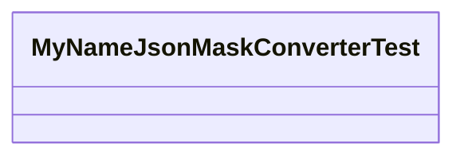

<div id="MyNameJsonMaskConverterTest.MyUsers-class-diagram"></div>

##### `MyNameJsonMaskConverterTest.MyUsers` class diagram

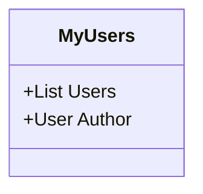

<div id="MyNameJsonMaskConverterTest.TestLogMaskedAttributes-class-diagram"></div>

##### `MyNameJsonMaskConverterTest.TestLogMaskedAttributes` class diagram

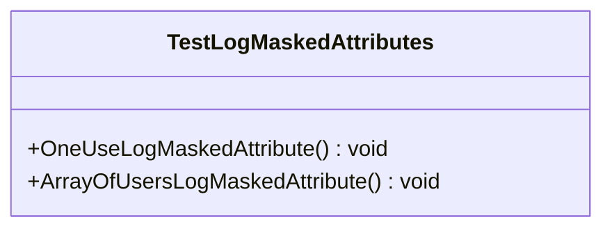

<div id="MyNameJsonMaskConverterTest.User-class-diagram"></div>

##### `MyNameJsonMaskConverterTest.User` class diagram

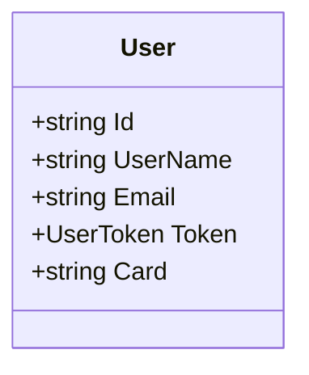

<div id="MyNameJsonMaskConverterTest.UserToken-class-diagram"></div>

##### `MyNameJsonMaskConverterTest.UserToken` class diagram

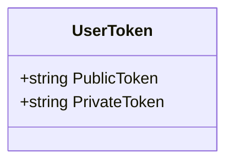

<div id="MyCardJsonMaskConverter-class-diagram"></div>

##### `MyCardJsonMaskConverter` class diagram

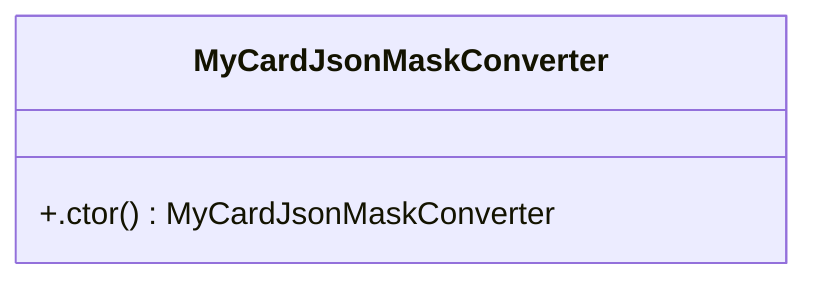

<div id="MyDefaultJsonMaskConverter-class-diagram"></div>

##### `MyDefaultJsonMaskConverter` class diagram

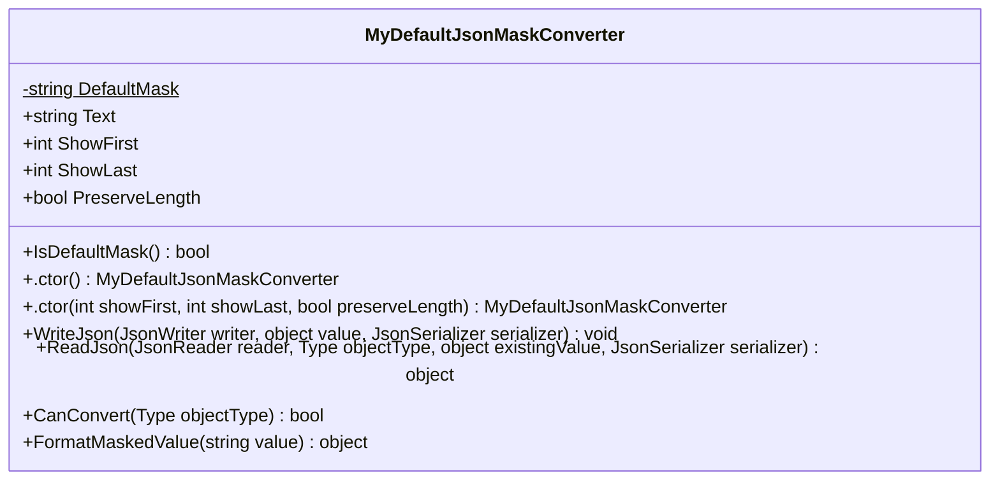

<div id="MyEmailJsonMaskConverter-class-diagram"></div>

##### `MyEmailJsonMaskConverter` class diagram

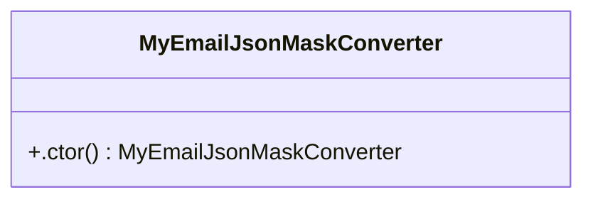

<div id="MyNameJsonMaskConverter-class-diagram"></div>

##### `MyNameJsonMaskConverter` class diagram

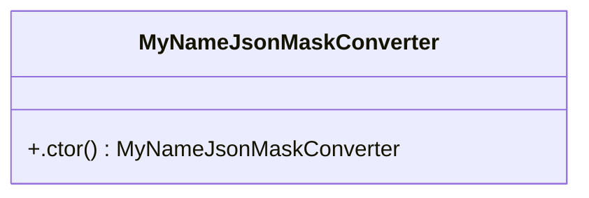

<div id="MyPhoneJsonMaskConverter-class-diagram"></div>

##### `MyPhoneJsonMaskConverter` class diagram

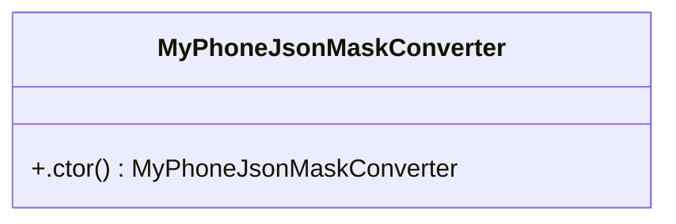

<div id="LivnessMiddleware-class-diagram"></div>

##### `LivnessMiddleware` class diagram

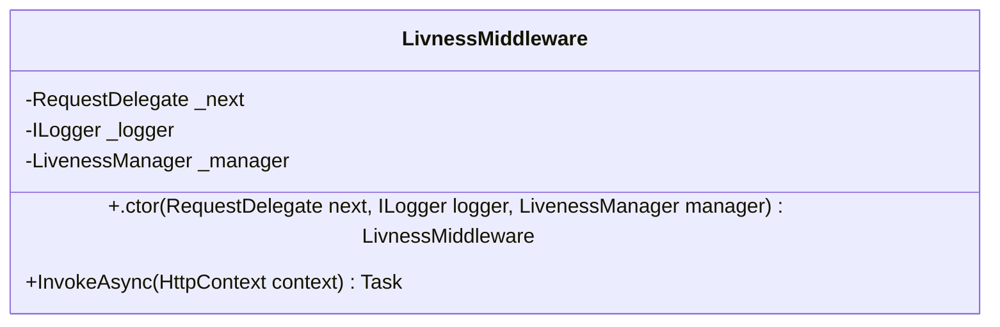

<div id="ILivenessReporter-class-diagram"></div>

##### `ILivenessReporter` class diagram

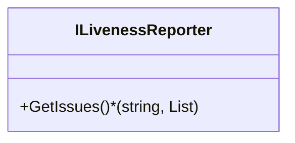

<div id="LivenessManager-class-diagram"></div>

##### `LivenessManager` class diagram

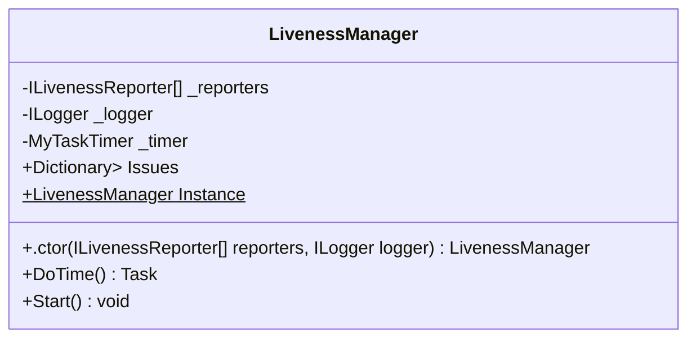

<div id="ActivityEnricher-class-diagram"></div>

##### `ActivityEnricher` class diagram

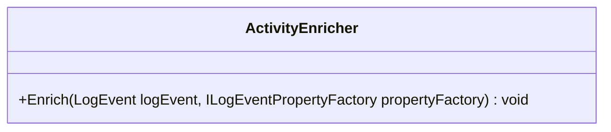

<div id="ActivityExtensions-class-diagram"></div>

##### `ActivityExtensions` class diagram

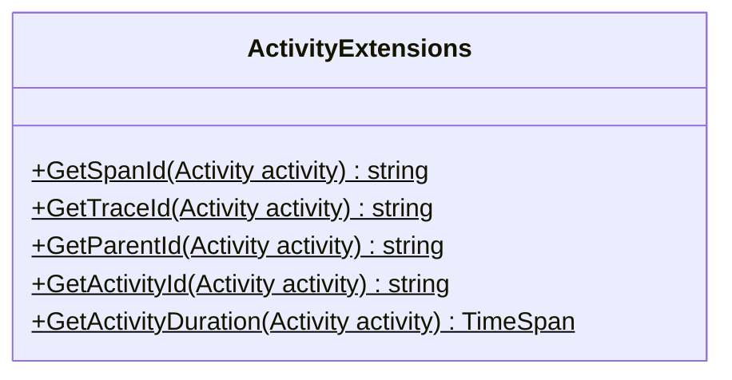

<div id="ApplicationEnvironment-class-diagram"></div>

##### `ApplicationEnvironment` class diagram

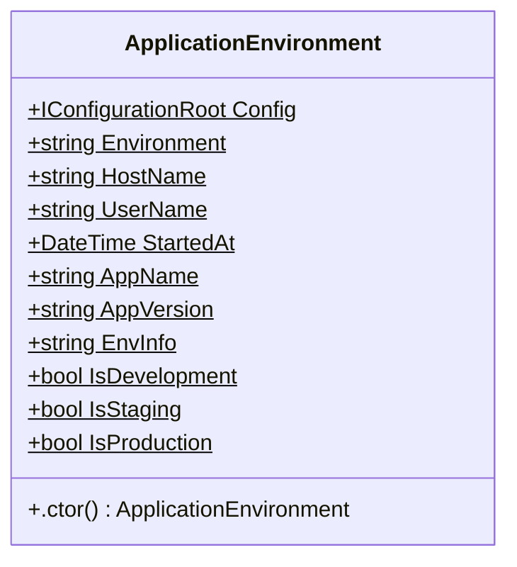

<div id="ApplicationLifetimeManagerBase-class-diagram"></div>

##### `ApplicationLifetimeManagerBase` class diagram

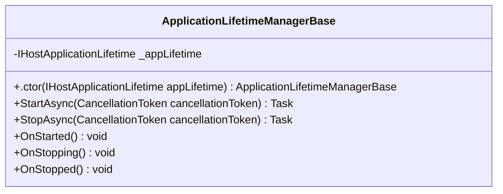

<div id="LogConfigurator.ElasticsearchConfig-class-diagram"></div>

##### `LogConfigurator.ElasticsearchConfig` class diagram

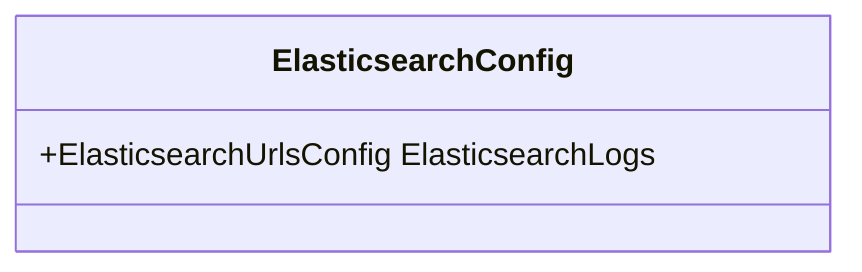

<div id="LogConfigurator.ElasticsearchUrlsConfig-class-diagram"></div>

##### `LogConfigurator.ElasticsearchUrlsConfig` class diagram

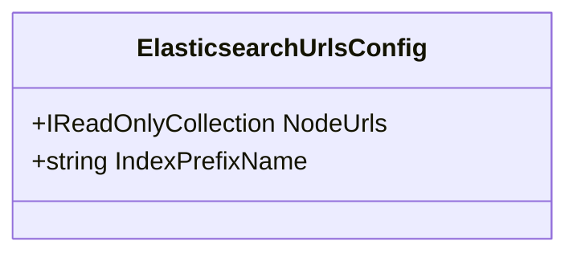

<div id="HexConverterUtils-class-diagram"></div>

##### `HexConverterUtils` class diagram

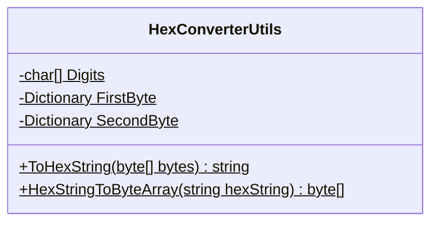

<div id="IsAliveResponse-class-diagram"></div>

##### `IsAliveResponse` class diagram

```mermaid
classDiagram
class IsAliveResponse{
    +IsAlive()$ string
}

```

<div id="LogConfigurator-class-diagram"></div>

##### `LogConfigurator` class diagram

```mermaid
classDiagram
class LogConfigurator{
    +ILoggerFactory LoggerFactoryInstance$
    +ConfigureElk_v2(string productName = null, string seqServiceUrl = null, LogElkSettings logElkSettings = null)$ ILoggerFactory
    +OverrideLogLevel(LoggerConfiguration config)$ void
    +SetupElk(LogElkSettings logElkSettings, LoggerConfiguration config)$ void
    +Configure(string productName = null, string seqServiceUrl = null)$ ILoggerFactory
    +BuildConfigRoot()$ IConfigurationRoot
    +SetupProperty(string productName, LoggerConfiguration config)$ void
    +SetupConsole(IConfigurationRoot configRoot, LoggerConfiguration config)$ void
    +SetupSeq(LoggerConfiguration config, string seqServiceUrl)$ void
}

```

<div id="LogElkSettings-class-diagram"></div>

##### `LogElkSettings` class diagram

```mermaid
classDiagram
class LogElkSettings{
    +Dictionary<string, string> Urls
    +string IndexPrefix
    +string User
    +string Password
}

```

<div id="LogFactoryDatabaseWrapper-class-diagram"></div>

##### `LogFactoryDatabaseWrapper` class diagram

```mermaid
classDiagram
class LogFactoryDatabaseWrapper{
    -ILoggerFactory _factory
    +.ctor(ILoggerFactory factory) LogFactoryDatabaseWrapper
    +Dispose() void
    +AddProvider(ILoggerProvider provider) void
    +CreateLogger(string categoryName) ILogger
}

```

<div id="LogFactorySafeWrapper-class-diagram"></div>

##### `LogFactorySafeWrapper` class diagram

```mermaid
classDiagram
class LogFactorySafeWrapper{
    -ILoggerFactory _factory
    +.ctor(ILoggerFactory factory) LogFactorySafeWrapper
    +Dispose() void
    +AddProvider(ILoggerProvider provider) void
    +CreateLogger(string categoryName) ILogger
}

```

<div id="LoggerDatabaseWrapper-class-diagram"></div>

##### `LoggerDatabaseWrapper` class diagram

```mermaid
classDiagram
class LoggerDatabaseWrapper{
    -ILogger _logger
    +.ctor(ILogger logger) LoggerDatabaseWrapper
    +BeginScope<TState>(TState state) IDisposable
    +IsEnabled(LogLevel logLevel) bool
    +Log<TState>(LogLevel logLevel, EventId eventId, TState state, Exception exception, Func<TState, Exception, string> formatter) void
}

```

<div id="LoggerSafeWrapper-class-diagram"></div>

##### `LoggerSafeWrapper` class diagram

```mermaid
classDiagram
class LoggerSafeWrapper{
    -ILogger _logger
    +.ctor(ILogger logger) LoggerSafeWrapper
    +BeginScope<TState>(TState state) IDisposable
    +IsEnabled(LogLevel logLevel) bool
    +Log<TState>(LogLevel logLevel, EventId eventId, TState state, Exception exception, Func<TState, Exception, string> formatter) void
    +LogToConsole<TState>(LogLevel logLevel, EventId eventId, TState state, Exception exception, Func<TState, Exception, string> formatter) void
}

```

<div id="MyExceptionProcessor-class-diagram"></div>

##### `MyExceptionProcessor` class diagram

```mermaid
classDiagram
class MyExceptionProcessor{
    +OnEnd(Activity data) void
}

```

<div id="MyLoggerFactoryDatabaseWrapper-class-diagram"></div>

##### `MyLoggerFactoryDatabaseWrapper` class diagram

```mermaid
classDiagram
class MyLoggerFactoryDatabaseWrapper{
    +ToDatabaseLogger(ILoggerFactory factory)$ ILoggerFactory
    +ToDatabaseLogger(ILogger logger)$ ILogger
}

```

<div id="MyLoggerFactorySafeWrapper-class-diagram"></div>

##### `MyLoggerFactorySafeWrapper` class diagram

```mermaid
classDiagram
class MyLoggerFactorySafeWrapper{
    +ToSafeLogger(ILoggerFactory factory)$ ILoggerFactory
    +ToSaveLogger(ILogger logger)$ ILogger
}

```

<div id="MySpanTraceProcessor-class-diagram"></div>

##### `MySpanTraceProcessor` class diagram

```mermaid
classDiagram
class MySpanTraceProcessor{
    +OnEnd(Activity data) void
}

```

<div id="MyTelemetry-class-diagram"></div>

##### `MyTelemetry` class diagram

```mermaid
classDiagram
class MyTelemetry{
    -ActivitySource Source$
    +.ctor() MyTelemetry
    +AddMyTelemetry(IServiceCollection services, string appNamePrefix, string zipkinEndpoint = null, Func<HttpRequest, bool> httpRequestFilter = null, IEnumerable<string> sources = null, bool errorStatusOnException = false, bool setDbStatementForText = true)$ IServiceCollection
    +StartActivity(string name, ActivityKind kind = null)$ Activity
    +FailActivity(Exception ex)$ Activity
    +WriteToActivity(Exception ex)$ Activity
    +AddToActivityAsJsonTag(object obj, string tag)$ Activity
    +AddToActivityAsTag(object obj, string tag)$ Activity
}

```

<div id="SerilogSafeWrapper-class-diagram"></div>

##### `SerilogSafeWrapper` class diagram

```mermaid
classDiagram
class SerilogSafeWrapper{
    -ILogger _logger
    +.ctor(ILogger logger) SerilogSafeWrapper
    +Write(LogEvent logEvent) void
    +LogToConsole(LogEvent logEvent) void
}

```

<div id="StartupHelper-class-diagram"></div>

##### `StartupHelper` class diagram

```mermaid
classDiagram
class StartupHelper{
    +BindCodeFirstGrpc(IServiceCollection services, Action<GrpcServiceOptions>? configureOptions = null)$ IServiceCollection
    +ConfigureJetWallet<TLifetimeManager>(IServiceCollection services, string zipkinUrl, string appNamePrefix = "SP-")$ void
    +ConfigureJetWallet(IApplicationBuilder app, IWebHostEnvironment env, Action<IEndpointRouteBuilder> configureGrpcServices)$ void
    +ConfigureJetWallet(ContainerBuilder builder)$ void
}

```

<div id="Utils-class-diagram"></div>

##### `Utils` class diagram

```mermaid
classDiagram
class Utils{
    +EncodeToSha1(string str)$ byte[]
    +ToJson(object obj)$ string
    +FromJson<T>(string json)$ T
}

```

<div id="MyBuffer&lt;T&gt;-class-diagram"></div>

##### `MyBuffer<T>` class diagram

```mermaid
classDiagram
class MyBuffer<T>{
    -List<T> _data
    -object _gate
    +Add(T item) void
    +AddRange(IEnumerable<T> items) void
    +ExtractAll() List<T>
}

```

<div id="MyLocker-class-diagram"></div>

##### `MyLocker` class diagram

```mermaid
classDiagram
class MyLocker{
    -SemaphoreSlim _semaphore
    +GetLocker() Task<IDisposable>
}

```

<div id="MyTaskTimer-class-diagram"></div>

##### `MyTaskTimer` class diagram

```mermaid
classDiagram
IDisposable <|-- MyTaskTimer : implements
class MyTaskTimer{
    -string _owner
    -TimeSpan _interval
    -ILogger _logger
    -Func<Task> _doProcess
    -CancellationTokenSource _token
    -Task _process
    +bool IsTelemetryActive
    +.ctor(string owner, TimeSpan interval, ILogger logger, Func<Task> doProcess) MyTaskTimer
    +.ctor(Type owner, TimeSpan interval, ILogger logger, Func<Task> doProcess) MyTaskTimer
    +Create<T>(TimeSpan interval, ILogger logger, Func<Task> doProcess)$ MyTaskTimer
    +ChangeInterval(TimeSpan interval) void
    +Start() void
    +DoProcessInt() Task
    +Stop() void
    +Dispose() void
    +DisableTelemetry() MyTaskTimer
}

```

<div id="MyLocker.SemaphoreRelease-class-diagram"></div>

##### `MyLocker.SemaphoreRelease` class diagram

```mermaid
classDiagram
class SemaphoreRelease{
    -SemaphoreSlim _semaphore
    +.ctor(SemaphoreSlim semaphore) SemaphoreRelease
    +Dispose() void
}

```

<div id="MyLogger-class-diagram"></div>

##### `MyLogger` class diagram

```mermaid
classDiagram
class MyLogger{
    -ILogger _logger
    +.ctor(ILogger logger) MyLogger
    +Write(LogEvent logEvent) void
}

```

<div id="Program-class-diagram"></div>

##### `Program` class diagram

```mermaid
classDiagram
class Program{
    +Main(string[] args)$ Task
}

```

*This file is maintained by a bot.*

<!-- markdownlint-restore -->
